> 本文结合一个从 AOSP 源码中提取的 Binder 用户态实现项目，由浅入深地讲解 Android Binder IPC 的核心原理。所有代码均可在 Android 模拟器上实际运行。  
  

## 1. 为什么是 Binder？  
  
Android 是一个多进程系统——每个 App 运行在独立的进程中，系统服务（如 ActivityManagerService、PackageManagerService）也各自独立。进程之间要通信，就需要 IPC（Inter-Process Communication）机制。  
  
### Linux 已有的 IPC 方案  
  
| 机制 | 特点 | 问题 |  
|------|------|------|  
| 管道 (Pipe) | 单向，父子进程间 | 不适合任意进程间通信 |  
| 信号 (Signal) | 异步通知 | 只能传递信号编号，无法传递复杂数据 |  
| 共享内存 (Shared Memory) | 速度最快，零拷贝 | 需要自己处理同步，没有安全机制 |  
| Socket | 通用，支持网络 | 开销大，两次数据拷贝 |  
| 消息队列 (Message Queue) | 可传递结构化数据 | 两次拷贝，无法传递文件描述符 |  
  
### Binder 的优势  
  
Binder 是 Android 专门设计的 IPC 机制，它解决了上述方案的痛点：  
  
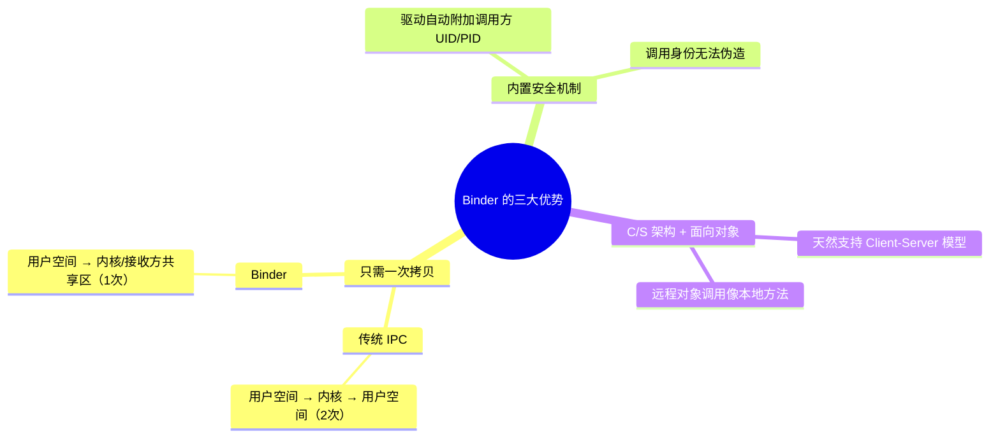
  
### 一次拷贝的秘密：mmap  
  
传统 IPC 需要两次拷贝：发送方 → 内核缓冲区 → 接收方。Binder 通过 `mmap()` 让接收方的用户空间和内核空间共享同一块物理内存，数据从发送方拷贝到内核后，接收方可以直接读取，省去了第二次拷贝。  
  
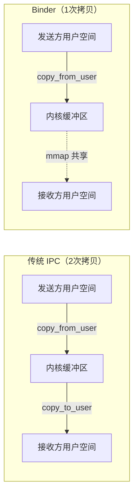
  
在我们的项目代码中，`binder_open()` 就完成了这个 mmap 映射：  
  
```c  
// binder.c - binder_open()  
struct binder_state *binder_open(const char* driver, size_t mapsize)  
{  
    struct binder_state *bs;

    bs = malloc(sizeof(*bs));
    // 1. 打开 Binder 驱动设备文件  
    bs->fd = open(driver, O_RDWR | O_CLOEXEC);  
    // 2. 检查驱动版本  
    ioctl(bs->fd, BINDER_VERSION, &vers);  
    // 3. 关键！mmap 建立共享内存映射  
    //    PROT_READ: 用户空间只读（写入由驱动完成）  
    //    MAP_PRIVATE: 私有映射  
    bs->mapsize = mapsize;
    bs->mapped = mmap(NULL, mapsize, PROT_READ, MAP_PRIVATE, bs->fd, 0);

    return bs;
}  
```  
  
注意 `mmap` 的参数：`PROT_READ` 表示用户空间只能读，写入操作由内核驱动完成。这就是为什么数据"自动"出现在接收方内存中的原因。  
  
---  
  
## 2. Binder 架构全景  
  
Binder 通信涉及四个核心角色：  
  
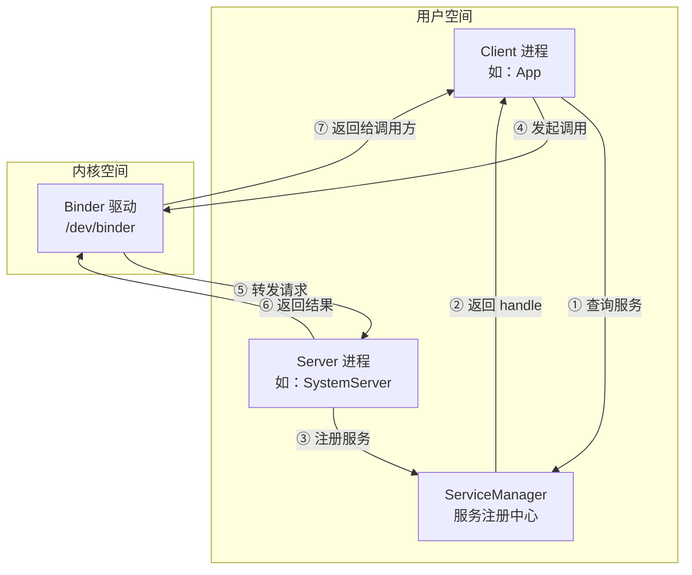
  
### 四大角色  
  
| 角色 | 职责 | 对应项目文件 |  
|------|------|-------------|  
| **Binder 驱动** | 内核模块，负责跨进程数据传输、线程管理、引用计数 | Linux 内核 `/dev/binder` |  
| **ServiceManager** | 服务注册中心，handle 固定为 0 | `service_manager.c` |  
| **Server** | 提供服务的进程，注册服务并等待请求 | `test_server.c` |  
| **Client** | 使用服务的进程，查找服务并发起调用 | `test_client.c` |  
  
一个形象的比喻：  
  
- **Binder 驱动** = 电话交换机（负责接通电话）  
- **ServiceManager** = 114 查号台（告诉你号码）  
- **Server** = 商家（在查号台登记电话号码，等待来电）  
- **Client** = 顾客（先查号，再打电话）  
  
---  
  
## 3. Binder 驱动：一切的基础  
  
Binder 驱动是一个 Linux 字符设备（`/dev/binder`），它不对应任何硬件，而是一个纯软件实现的内核模块。所有 Binder 通信都通过 `ioctl()` 系统调用与驱动交互。  
  
### 3.1 驱动提供的核心 ioctl 命令  
  
| ioctl 命令 | 用途 | 使用场景 |  
|------------|------|---------|  
| `BINDER_VERSION` | 获取驱动协议版本 | `binder_open()` 时检查兼容性 |  
| `BINDER_SET_CONTEXT_MGR` | 注册为 context manager | ServiceManager 启动时 |  
| `BINDER_WRITE_READ` | 读写数据（最核心的命令） | 所有通信都通过它 |  
  
### 3.2 BINDER_WRITE_READ：通信的核心  
  
几乎所有 Binder 操作最终都归结为一个 `ioctl(fd, BINDER_WRITE_READ, &bwr)` 调用。`binder_write_read` 结构体同时携带"要写入的数据"和"要读取的缓冲区"：  
  
```c  
// Linux 内核头文件中的定义  
struct binder_write_read {  
    binder_size_t write_size;      // 要写入的数据大小  
    binder_size_t write_consumed;  // 驱动实际消费了多少  
    binder_uintptr_t write_buffer; // 写入数据的指针  
  
    binder_size_t read_size;       // 读取缓冲区大小  
    binder_size_t read_consumed;   // 驱动实际写入了多少  
    binder_uintptr_t read_buffer;  // 读取缓冲区的指针  
};  
```  
  
写入缓冲区中的数据以 `BC_*`（Binder Command）命令开头，读取缓冲区中返回的数据以 `BR_*`（Binder Return）命令开头：  
  
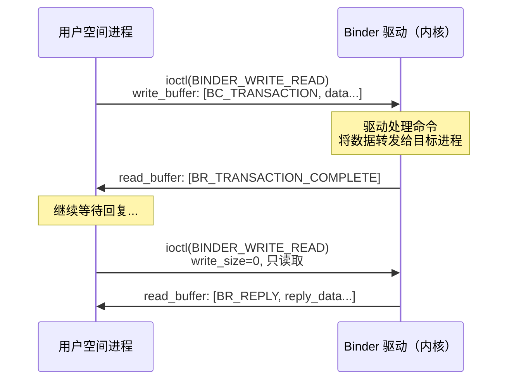
  
### 3.3 BC/BR 命令协议  
  
**BC_*（用户空间 → 驱动）：**  
  
| 命令 | 含义 |  
|------|------|  
| `BC_TRANSACTION` | 发起一次事务（Client → Server） |  
| `BC_REPLY` | 回复一次事务（Server → Client） |  
| `BC_ENTER_LOOPER` | 通知驱动：当前线程进入循环，可以接收请求 |  
| `BC_ACQUIRE` / `BC_RELEASE` | 增加/减少 Binder 引用计数 |  
| `BC_FREE_BUFFER` | 释放驱动分配的数据缓冲区 |  
| `BC_REQUEST_DEATH_NOTIFICATION` | 注册死亡通知 |  
  
**BR_*（驱动 → 用户空间）：**  
  
| 命令 | 含义 |  
|------|------|  
| `BR_TRANSACTION` | 收到一个事务请求（Server 端收到） |  
| `BR_REPLY` | 收到事务回复（Client 端收到） |  
| `BR_TRANSACTION_COMPLETE` | 事务已被驱动接收 |  
| `BR_DEAD_BINDER` | 对端进程已死亡 |  
| `BR_FAILED_REPLY` | 事务失败 |  
| `BR_NOOP` | 空操作 |  
  
在项目代码中，`binder_parse()` 函数就是解析这些 BR_* 命令的核心逻辑：  
  
```c  
// binder.c - binder_parse()（简化版）  
int binder_parse(struct binder_state *bs, struct binder_io *bio,  
                 uintptr_t ptr, size_t size, binder_handler func)
{  
    uintptr_t end = ptr + size;  

    while (ptr < end) {
        uint32_t cmd = *(uint32_t *)ptr;  // 读取命令码
        ptr += sizeof(uint32_t);  

        switch (cmd) {
        case BR_NOOP:
            break;

        case BR_TRANSACTION_COMPLETE:
            break;

        case BR_TRANSACTION: {  // Server 端收到请求
            struct binder_transaction_data_secctx txn;

            memcpy(&txn.transaction_data, (void *)ptr, sizeof(...));

            if (func) {
                struct binder_io msg, reply;

                bio_init(&reply, rdata, sizeof(rdata), 4);
                bio_init_from_txn(&msg, &txn.transaction_data);
                // 调用业务处理函数  
                res = func(bs, &txn, &msg, &reply);  
                // 发送回复  
                binder_send_reply(bs, &reply, ...);
            }
            break;
        }

        case BR_REPLY: {  // Client 端收到回复
            struct binder_transaction_data *txn = (void *)ptr;

            if (bio) {
                bio_init_from_txn(bio, txn);  // 将回复数据填入 bio
            }
            break;
        }

        case BR_DEAD_BINDER: {  // 对端死亡通知
            struct binder_death *death = ...;

            death->func(bs, death->ptr);
            break;
        }

        case BR_FAILED_REPLY:
        case BR_DEAD_REPLY:
            return -1;  // 通信失败
        }
    }

    return r;
}  
```  
  
这个函数是整个用户态 Binder 库的"大脑"——所有从驱动返回的数据都经过它解析和分发。  
  
---  
  
## 4. ServiceManager：服务的"电话簿"  
  
ServiceManager 是 Android 系统中第一个启动的 Binder 服务，它的 handle 固定为 **0**。所有其他服务都需要先向它注册，Client 也需要通过它来查找服务。  
  
### 4.1 ServiceManager 的启动流程  
  
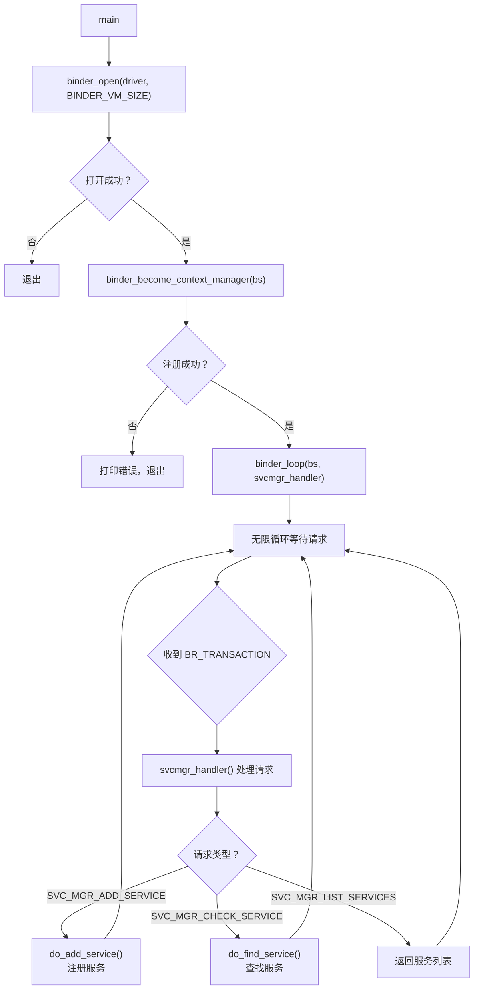
  
对应项目代码 `service_manager.c` 的 main 函数：  
  
```c  
// service_manager.c - main()  
int main(int argc, char **argv)  
{  
    struct binder_state *bs;
    char *driver = (argc > 1) ? argv[1] : "/dev/binder";

    // 1. 打开 Binder 驱动  
    bs = binder_open(driver, BINDER_VM_SIZE);  
    // 2. 注册成为 context manager（handle = 0）  
    if (binder_become_context_manager(bs)) {
        fprintf(stdout, "cannot become context manager (%s)\n", strerror(errno));
        return -1;
    }
    // 3. 进入循环，等待并处理请求  
    binder_loop(bs, svcmgr_handler);
    return 0;
}  
```  
  
### 4.2 服务注册：do_add_service()  
  
当 Server 进程调用 `svcmgr_publish()` 注册服务时，ServiceManager 的 `svcmgr_handler` 会收到 `SVC_MGR_ADD_SERVICE` 请求，然后调用 `do_add_service()` 将服务信息保存到链表中：  
  
```c  
// service_manager.c - 服务信息结构  
struct svcinfo {  
    struct svcinfo *next;         // 链表指针
    uint32_t handle;         // Binder handle（驱动分配的引用）  
    struct binder_death death;
    int allow_isolated;
    uint32_t dumpsys_priority;
    size_t len;              // 服务名长度
    uint16_t name[0];        // 服务名（变长数组）  
};  
  
// 全局服务链表  
struct svcinfo *svclist = NULL;  
```  
  
服务注册的核心逻辑：  
  
```c  
// service_manager.c - do_add_service()（简化）  
int do_add_service(struct binder_state *bs, const uint16_t *s, size_t len,  
                   uint32_t handle, uid_t uid, int allow_isolated,
                   uint32_t dumpsys_priority, pid_t spid)
{  
    struct svcinfo *si;  

    // 1. 检查服务名长度  
    if (len > 127) {
        return -1;
    }

    // 2. 检查是否已存在同名服务  
    si = find_svc(s, len);
    if (si) {
        if (si->handle) {
            // 释放旧的 handle
            svcinfo_death(bs, si);
        }
        si->handle = handle;  // 更新 handle
    } else {
        // 3. 创建新的服务记录
        si = malloc(sizeof(*si) + (len + 1) * sizeof(uint16_t));
        si->handle = handle;
        si->len = len;
        memcpy(si->name, s, (len + 1) * sizeof(uint16_t));
        si->name[len] = '\0';  
        // 4. 插入链表头部  
        si->next = svclist;
        svclist = si;
    }

    // 5. 增加 handle 的引用计数 & 注册死亡通知  
    binder_acquire(bs, handle);
    binder_link_to_death(bs, handle, &si->death);
    return 0;
}  
```  
  
### 4.3 服务查找：do_find_service()  
  
Client 通过 `SVC_MGR_CHECK_SERVICE` 查找服务时，ServiceManager 遍历链表找到对应的 handle 返回：  
  
```c  
// service_manager.c - do_find_service()  
uint32_t do_find_service(const uint16_t *s, size_t len,  
                         uid_t uid, pid_t spid, const char *sid)
{  
    struct svcinfo *si = find_svc(s, len);  

    if (!si || !si->handle) {
        return 0;  // 服务不存在
    }  

    // 权限检查（demo 中已禁用 SELinux）  
    if (!si->allow_isolated) {
        // ... 检查调用方权限
    }  

    return si->handle;  // 返回服务的 handle
}  
```  
  
> **什么是 handle？** handle 是 Binder 驱动为每个 Binder 引用分配的整数标识。Client 拿到 handle 后，就可以通过 `binder_call(bs, &msg, &reply, handle, code)` 向对应的 Server 发起调用。handle 类似于文件描述符——它是进程本地的，不同进程中同一个服务的 handle 值可能不同。  
  
---  
  
## 5. 一次完整的 Binder 通信  
  
现在让我们用项目中的 `test_server.c` 和 `test_client.c` 来追踪一次完整的 Binder IPC 调用。  
  
### 5.1 全景流程图  
  
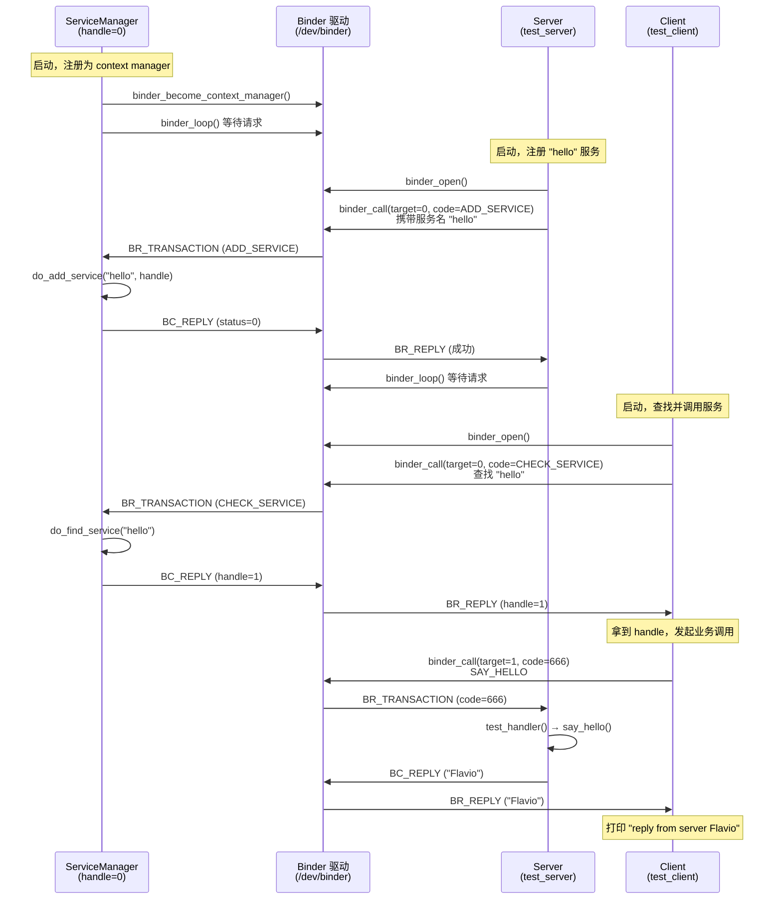
  
### 5.2 Server 端：注册服务并等待  
  
```c  
// test_server.c - main()  
int main(int argc, char **argv)  
{  
    struct binder_state *bs;
    uint32_t svcmgr = BINDER_SERVICE_MANAGER;  // handle = 0
    const char *driver = (argc > 1) ? argv[1] : "/dev/binder";

    // 1. 打开 Binder 驱动  
    bs = binder_open(driver, BINDER_VM_SIZE);  
    // 2. 向 ServiceManager 注册 "hello" 服务  
    //    target=0 表示发给 ServiceManager
    //    (void*)123 是一个 cookie，用于标识本地对象
    ret = svcmgr_publish(bs, BINDER_SERVICE_MANAGER, "hello", (void *) 123);  
    // 3. 进入循环，等待 Client 的请求  
    binder_loop(bs, test_handler);
}  
```  
  
`svcmgr_publish()` 的内部实现展示了如何构造一次 Binder 调用：  
  
```c  
// test_server.c - svcmgr_publish()  
int svcmgr_publish(struct binder_state *bs, uint32_t target,  
                   const char *name, void *ptr)
{  
    unsigned iodata[512 / 4];
    struct binder_io msg, reply;

    // 1. 初始化消息缓冲区  
    bio_init(&msg, iodata, sizeof(iodata), 4);  
    // 2. 按协议填充数据  
    bio_put_uint32(&msg, 0);                // strict mode header
    bio_put_string16_x(&msg, SVC_MGR_NAME); // 接口名
    bio_put_string16_x(&msg, name);         // 服务名 "hello"
    bio_put_obj(&msg, ptr);                 // Binder 对象（本地引用）
  
    // 3. 发起 Binder 调用  
    //    target=0 → ServiceManager
    //    code=SVC_MGR_ADD_SERVICE → 注册服务
    if (binder_call(bs, &msg, &reply, target, SVC_MGR_ADD_SERVICE)) {
        return -1;
    }

    status = bio_get_uint32(&reply);  // 获取返回状态  
    binder_done(bs, &msg, &reply);    // 释放缓冲区
    return status;
}  
```  
  
Server 收到请求后的处理逻辑：  
  
```c  
// test_server.c - test_handler()  
int test_handler(struct binder_state *bs,  
                 struct binder_transaction_data_secctx *txn_secctx,
                 struct binder_io *msg,
                 struct binder_io *reply)
{  
    struct binder_transaction_data *txn = &txn_secctx->transaction_data;  

    fprintf(stdout, "[server] handler code=%d on tid=%d\n", txn->code, (int)gettid());  

    switch (txn->code) {
    case TEST_SERVER_SAY_HELLO:  // code = 666
        ret = say_hello();       // 执行业务逻辑
        bio_put_string16_x(reply, ret);
        break;

    case TEST_SERVER_SLOW_CALL:  // code = 667，sleep 5s 模拟慢处理
        ret = slow_call();
        bio_put_string16_x(reply, ret);
        break;

    case TEST_SERVER_LARGE_REPLY:  // code = 668，构造大回复数据
        // 填充大量数据，模拟 TransactionTooLargeException
        for (i = 0; i < 20; i++) {
            bio_put_string16_x(reply, "PADDING_DATA_...");
        }
        break;

    default:
        return -1;
    }

    bio_put_uint32(reply, 0);  // 状态码  
    return 0;
}  
```  
  
### 5.3 Client 端：查找服务并调用  
  
```c  
// test_client.c - main()  
int main(int argc, char **argv)  
{  
    struct binder_state *bs;
    uint32_t svcmgr = BINDER_SERVICE_MANAGER;
    const char *driver = (argc > 1) ? argv[1] : "/dev/binder";
    const char *mode = (argc > 2) ? argv[2] : "hello";

    // 1. 打开 Binder 驱动（使用与 AOSP 一致的 mmap 大小）  
    bs = binder_open(driver, BINDER_VM_SIZE);  
    // 2. 从 ServiceManager 查找 "hello" 服务  
    handle = svcmgr_lookup(bs, svcmgr, "hello");  
    // 3. 根据模式执行不同测试  
    if (strcmp(mode, "hello") == 0) {
        say_hello(bs, handle);  // 正常调用
    } else if (strcmp(mode, "flood") == 0) {
        test_flood(driver, handle, 20);  // 并发慢请求，模拟 Binder 风暴
    } else if (strcmp(mode, "large") == 0) {
        test_large(bs, handle);  // 超大数据，模拟 TransactionTooLargeException
    }
}  
```  
  
`svcmgr_lookup()` 查找服务的过程：  
  
```c  
// test_client.c - svcmgr_lookup()  
uint32_t svcmgr_lookup(struct binder_state *bs, uint32_t target,  
                       const char *name)
{  
    unsigned iodata[512 / 4];
    struct binder_io msg, reply;

    bio_init(&msg, iodata, sizeof(iodata), 4);
    bio_put_uint32(&msg, 0);                // strict mode header
    bio_put_string16_x(&msg, SVC_MGR_NAME); // 接口名
    bio_put_string16_x(&msg, name);           // 要查找的服务名
  
    // 向 ServiceManager (target=0) 发起查询  
    binder_call(bs, &msg, &reply, target, SVC_MGR_CHECK_SERVICE);  
    // 从回复中提取 handle
    handle = bio_get_ref(&reply);  
    if (handle) {
        binder_acquire(bs, handle);  // 增加引用计数
    }
  
    binder_done(bs, &msg, &reply);
    return handle;
}  
```  
  
### 5.4 binder_call() 的内部实现  
  
`binder_call()` 是发起 Binder 调用的核心函数，它将用户数据打包成 `BC_TRANSACTION` 命令发给驱动，然后等待 `BR_REPLY`：  
  
```c  
// binder.c - binder_call()  
int binder_call(struct binder_state *bs,  
                struct binder_io *msg, struct binder_io *reply,
                uint32_t target, uint32_t code)
{  
    struct binder_write_read bwr;
    struct {
        uint32_t cmd;
        struct binder_transaction_data txn;
    } __attribute__((packed)) writebuf;

    // 1. 构造 BC_TRANSACTION 命令  
    writebuf.cmd = BC_TRANSACTION;
    writebuf.txn.target.handle = target;  // 目标 handle
    writebuf.txn.code = code;             // 调用码
    writebuf.txn.flags = 0;
    writebuf.txn.data_size = msg->data - msg->data0;
    writebuf.txn.offsets_size = ((char *)msg->offs) - ((char *)msg->offs0);
    writebuf.txn.data.ptr.buffer = (uintptr_t)msg->data0;
    writebuf.txn.data.ptr.offsets = (uintptr_t)msg->offs0;

    bwr.write_size = sizeof(writebuf);
    bwr.write_buffer = (uintptr_t)&writebuf;

    // 2. 循环 ioctl 直到收到回复  
    for (;;) {
        bwr.read_size = sizeof(readbuf);
        bwr.read_buffer = (uintptr_t)readbuf;

        // 发送命令 + 等待回复  
        res = ioctl(bs->fd, BINDER_WRITE_READ, &bwr);  
        // 解析驱动返回的数据  
        res = binder_parse(bs, reply, (uintptr_t)readbuf, bwr.read_consumed, 0);
        if (res == 0) {
            return 0;  // 收到 BR_REPLY，成功
        }
        if (res < 0) {
            goto fail;  // 出错
        }
        // res > 0: 还没收到回复，继续循环  
    }
}  
```  
  
注意 `binder_call` 中的 `for(;;)` 循环——第一次 ioctl 可能只收到 `BR_TRANSACTION_COMPLETE`（表示驱动已接收），需要再次 ioctl 才能收到 `BR_REPLY`。  
  
---  
  
## 6. 数据序列化：binder_io 与 Parcel  
  
跨进程通信不能直接传递指针，所有数据都需要序列化成字节流。在 C 层，项目使用 `binder_io` 结构体来完成这个工作；在 Android Framework 的 Java/C++ 层，对应的是 `Parcel` 类。  
  
### 6.1 binder_io 结构  
  
```c  
// binder.h  
struct binder_io {  
    char *data;            // 当前读写位置  
    binder_size_t *offs;   // 当前 offset 位置（用于 Binder 对象）  
    size_t data_avail;     // 剩余可用数据空间  
    size_t offs_avail;     // 剩余可用 offset 空间  
  
    char *data0;           // 数据缓冲区起始地址  
    binder_size_t *offs0;  // offset 缓冲区起始地址  
    uint32_t flags;        // 状态标志  
    uint32_t unused;
};  
```  
  
### 6.2 数据布局  
  
`binder_io` 的内存布局很巧妙——数据从前往后写，offset 从后往前写，共享同一块缓冲区：  
  
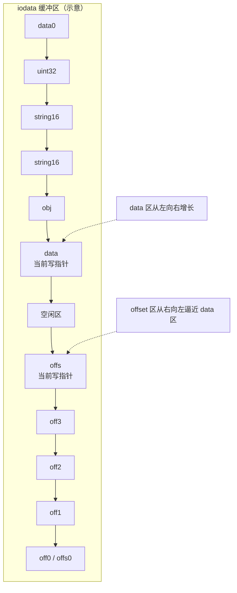
  
初始化代码：  
  
```c  
// binder.c - bio_init()  
void bio_init(struct binder_io *bio, void *data,  
              size_t maxdata, size_t maxoffs)
{  
    size_t n = maxoffs * sizeof(size_t);  // offset 区域大小  
  
    // offset 数组放在缓冲区末尾  
    bio->data = bio->data0 = (char *)data + n;
    bio->offs = bio->offs0 = data;
    bio->data_avail = maxdata - n;
    bio->offs_avail = maxoffs;
    bio->flags = 0;
}  
```  
  
### 6.3 写入操作  
  
```c  
// 写入 uint32
void bio_put_uint32(struct binder_io *bio, uint32_t n)
{
    uint32_t *ptr = bio_alloc(bio, sizeof(n));

    if (ptr) {
        *ptr = n;
    }
}  
  
// 写入字符串（UTF-16 编码，与 Android Java 层兼容）  
void bio_put_string16_x(struct binder_io *bio, const char *_str)
{  
    // 将 ASCII 字符串转为 UTF-16 写入  
    bio_put_uint32(bio, len);
    // 逐字符扩展为 uint16_t
}  
  
// 写入 Binder 对象（flat_binder_object）  
void bio_put_obj(struct binder_io *bio, void *ptr)
{  
    struct flat_binder_object *obj;

    obj = bio_alloc_obj(bio);  // 同时在 data 和 offs 中分配空间
    obj->hdr.type = BINDER_TYPE_BINDER;  // 本地 Binder 对象  
    obj->binder = (uintptr_t)ptr;
    obj->cookie = (uintptr_t)ptr;
}  
```  
  
### 6.4 与 Android Parcel 的对应关系  
  
| binder_io (C 层) | Parcel (Java/C++ 层) | 说明 |  
|-------------------|---------------------|------|  
| `bio_put_uint32()` | `Parcel.writeInt()` | 写入 32 位整数 |  
| `bio_put_string16_x()` | `Parcel.writeString()` | 写入字符串 |  
| `bio_put_obj()` | `Parcel.writeStrongBinder()` | 写入 Binder 对象引用 |  
| `bio_get_uint32()` | `Parcel.readInt()` | 读取 32 位整数 |  
| `bio_get_string16()` | `Parcel.readString()` | 读取字符串 |  
| `bio_get_ref()` | `Parcel.readStrongBinder()` | 读取 Binder 引用 |  
  
> 在 AOSP 中，`Parcel` 类（`frameworks/native/libs/binder/Parcel.cpp`）是 `binder_io` 的 C++ 升级版，功能更丰富，支持更多数据类型，但核心原理完全一致。  
  
---  
  
## 7. Java 层：AIDL 的 Stub/Proxy 模式  
  
在 Android 开发中，我们通常通过 AIDL（Android Interface Definition Language）来定义跨进程接口。编译器会自动生成 Stub（Server 端）和 Proxy（Client 端）代码。本项目的 Java 层手动实现了这个模式，帮助你理解 AIDL 背后到底发生了什么。  
  
### 7.1 整体架构  
  
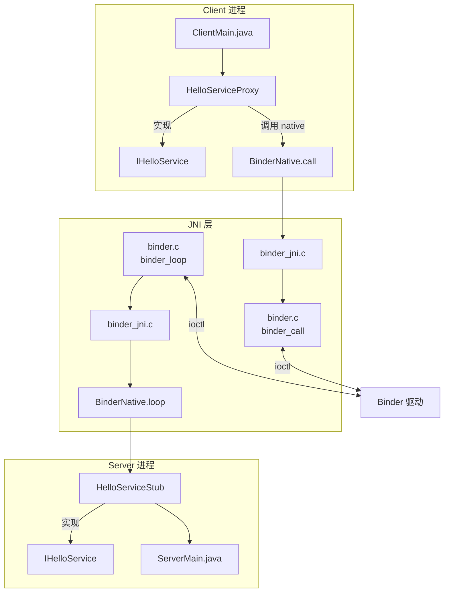
  
### 7.2 接口定义  
  
```java  
// IHelloService.java — 模拟 AIDL 生成的接口  
public interface IHelloService {
    int TRANSACTION_SAY_HELLO   = 666;  // 正常调用
    int TRANSACTION_SLOW_CALL   = 667;  // 慢处理（模拟线程池耗尽）  
    int TRANSACTION_LARGE_REPLY = 668;  // 大数据回复（模拟 TransactionTooLargeException）  
  
    String sayHello();  
    String slowCall();  
    String largeReply();  
}  
```  
  
在真实 Android 开发中，你只需要写一个 `.aidl` 文件：  
  
```  
// IHelloService.aidl  
interface IHelloService {  
    String sayHello();
}  
```  
  
编译器会自动生成 Stub 和 Proxy 类。我们的项目手动实现了这两个类。  
  
### 7.3 Server 端：Stub  
  
Stub 是 Server 端的基类，负责：  
1. 向 ServiceManager 注册服务  
2. 进入 Binder 循环  
3. 收到请求时，根据 transaction code 分发到具体方法  
  
```java  
// HelloServiceStub.java（简化）  
public abstract class HelloServiceStub implements IHelloService {  
    // 注册服务并进入循环（阻塞）  
    public void registerAndServe(String driver, String serviceName) {  
        long bs = BinderNative.open(driver);  
  
        // 1. 向 ServiceManager 注册  
        BinderNative.publish(bs, serviceName, TRANSACTION_SAY_HELLO);  
  
        // 2. 进入 Binder 循环，收到请求时回调 onTransaction
        //    多线程模型下，不同请求可能在不同 Binder 线程上执行
        BinderNative.loop(bs, (code, data) -> {  
            switch (code) {  
                case TRANSACTION_SAY_HELLO:
                    return sayHello();
                case TRANSACTION_SLOW_CALL:
                    return slowCall();
                case TRANSACTION_LARGE_REPLY:
                    return largeReply();
                default:
                    return null;
            }
        });
    }
}  
```  
  
Server 的入口：  
  
```java  
// ServerMain.java  
public class ServerMain {
    public static void main(String[] args) {  
        String driver = (args.length > 0) ? args[0] : "/dev/binder";  
  
        HelloServiceStub stub = new HelloServiceStub() {
            @Override  
            public String sayHello() {  
                return "Hello from Java Server!";
            }  

            @Override  
            public String slowCall() {  
                // sleep 5s 模拟慢处理，占住 Binder 线程  
                Thread.sleep(5000);  
                return "slow_done";
            }  

            @Override  
            public String largeReply() {  
                // 构造大字符串，模拟 TransactionTooLargeException
                StringBuilder sb = new StringBuilder();  
                for (int i = 0; i < 5000; i++) {
                    sb.append("PADDING_DATA_");
                }
                return sb.toString();  
            }
        };  
        stub.registerAndServe(driver, "hello");
    }
}  
```  
  
### 7.4 Client 端：Proxy  
  
Proxy 是 Client 端的代理类，它把本地方法调用转换为 Binder IPC 调用：  
  
```java  
// HelloServiceProxy.java  
public class HelloServiceProxy implements IHelloService {
    private final long bsPtr;
    private final int handle;

    public HelloServiceProxy(long bsPtr, String serviceName) {  
        this.bsPtr = bsPtr;  
        this.handle = BinderNative.lookup(bsPtr, serviceName);  
    }  

    @Override  
    public String sayHello() {  
        return BinderNative.call(bsPtr, handle, TRANSACTION_SAY_HELLO, null);
    }  

    @Override  
    public String slowCall() {  
        // 调用远程 slowCall，Server 端会 sleep 5s
        return BinderNative.call(bsPtr, handle, TRANSACTION_SLOW_CALL, null);
    }  

    @Override  
    public String largeReply() {  
        // 请求 Server 返回大数据  
        return BinderNative.call(bsPtr, handle, TRANSACTION_LARGE_REPLY, null);
    }
}  
```  
  
Client 的入口：  
  
```java  
// ClientMain.java  
public class ClientMain {
    public static void main(String[] args) {  
        String driver = (args.length > 0) ? args[0] : "/dev/binder";  
        String mode = (args.length > 1) ? args[1] : "hello";  
  
        HelloServiceProxy proxy = new HelloServiceProxy(driver, "hello");  
        switch (mode) {
            case "hello":
                // 正常调用
                String reply = proxy.sayHello();
                System.out.println("Reply: " + reply);
                break;
            case "flood":
                // 并发 N 个 slowCall，模拟 Binder 风暴
                testFlood(proxy, 20);
                break;
            case "large":
                // 请求大数据回复，模拟 TransactionTooLargeException
                testLarge(proxy);
                break;
        }
    }
}  
```  
  
### 7.5 Stub/Proxy 模式的本质  
  
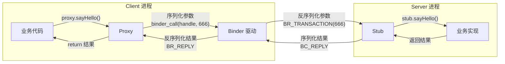
  
这就是 Binder 的"透明代理"魔法：  
  
- **Client** 调用 `proxy.sayHello()`，感觉像在调用本地方法  
- **Proxy** 内部将方法名（transaction code）和参数序列化，通过 Binder 驱动发送  
- **Stub** 收到请求后反序列化，调用真正的业务实现  
- 结果原路返回  
  
整个过程对 Client 的业务代码完全透明——这就是为什么 Android 的跨进程调用用起来和本地调用几乎一样。  
  
---  
  
## 8. Binder 的资源限制与常见异常  
  
理解了 Binder 通信原理后，我们来看实际开发中最容易踩的坑。Binder 并非无限制的通道，驱动层有明确的资源约束，超出限制就会抛出异常。  
  
### 8.1 两个关键限制  
  
在 AOSP 的 `ProcessState` 初始化时，有两个硬编码的限制。我们的项目在 `binder.h` 中定义了与 AOSP 一致的常量：  
  
```c  
// binder.h — 与 AOSP ProcessState 一致的资源限制  
#define BINDER_VM_SIZE              ((1 * 1024 * 1024) - (4096 * 2))  /* 1MB - 8KB ≈ 1016KB */  
#define DEFAULT_MAX_BINDER_THREADS  15  /* +1 主线程 = 最多 16 个并发 Binder 线程 */
```  
  
| 限制 | 默认值 | 含义 |  
|------|--------|------|  
| `BINDER_VM_SIZE` | 1MB - 8KB ≈ 1016KB | 每个进程 Binder mmap 的内存上限 |  
| `DEFAULT_MAX_BINDER_THREADS` | 15（+1主线程=16） | 最大并发 Binder 线程数 |  
  
在 `binder_open()` 中，这两个限制都被应用：  
  
```c  
// binder.c - binder_open()  
struct binder_state *binder_open(const char* driver, size_t mapsize)  
{  
    // ... open + version check ...  
    // 1. mmap 建立共享内存映射，mapsize 决定了内存上限  
    bs->mapsize = mapsize;
    bs->mapped = mmap(NULL, mapsize, PROT_READ, MAP_PRIVATE, bs->fd, 0);  
    // 2. 设置 Binder 驱动允许的最大线程数，与 AOSP ProcessState 行为一致  
    uint32_t maxthreads = DEFAULT_MAX_BINDER_THREADS;
    ioctl(bs->fd, BINDER_SET_MAX_THREADS, &maxthreads);  
    return bs;
}  
```  
  
调用方使用 `BINDER_VM_SIZE` 作为 mmap 大小，与真实 Android 系统一致：  
  
```c  
// test_server.c / test_client.c / service_manager.c  
bs = binder_open(driver, BINDER_VM_SIZE);  // 1MB - 8KB，与 AOSP 一致  
```  
  
这意味着一个进程中所有正在进行的 Binder 事务共享这 ~1MB 内存。同时驱动最多允许 16 个并发 Binder 线程（15 + 1 主线程）。  
  
### 8.2 FAILED_TRANSACTION：不只是"数据太大"  
  
当 Binder 驱动内存不足时，会返回 `FAILED_TRANSACTION`。但这里有个关键的误区：**这个限制是累积的，不是单次的。**  
  
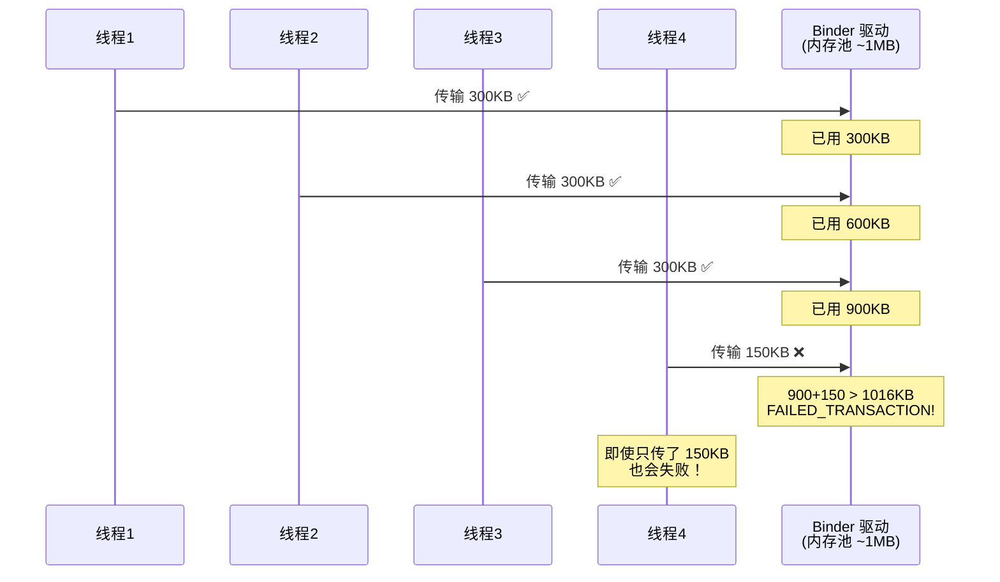
  
驱动内存是在 Server 端处理完请求、调用 `BC_FREE_BUFFER` 后才释放的。如果 Server 处理慢，多个并发请求的内存会持续累积。  
  
为了提前发现问题，我们在 `binder_call()` 中加入了数据大小检查，模拟 AOSP 中 200KB 的判定阈值：  
  
```c  
// binder.c - binder_call() 中的大小检查  
size_t data_size = msg->data - msg->data0;  
if (data_size > 200 * 1024) {  
    fprintf(stderr,
            "binder: WARNING: large transaction (%zu bytes), "
            "risk of TransactionTooLargeException\n",
            data_size);
}  
```  
  
在我们的项目中，`binder_send_reply()` 和 `binder_free_buffer()` 就是释放内存的关键路径：  
  
```c  
// binder.c - binder_send_reply()  
void binder_send_reply(struct binder_state *bs,  
                       struct binder_io *reply,
                       binder_uintptr_t buffer_to_free,
                       int status)
{  
    struct {
        uint32_t cmd_free;
        binder_uintptr_t buffer;
        uint32_t cmd_reply;
        struct binder_transaction_data txn;
    } __attribute__((packed)) data;

    // 先释放接收缓冲区，再发送回复  
    data.cmd_free = BC_FREE_BUFFER;  // ← 释放驱动内存
    data.buffer = buffer_to_free;
    data.cmd_reply = BC_REPLY;       // ← 发送回复
    // ...
    binder_write(bs, &data, sizeof(data));
}  
```  
  
### 8.3 异常类型判定逻辑  
  
AOSP 中 `FAILED_TRANSACTION` 会根据 Parcel 大小分成两种异常：  
  
```  
if (parcelSize > 200KB)  
    → TransactionTooLargeException   // "你这次传的数据太大了"  
else  
    → DeadObjectException            // "不是你的问题，可能是对端死了或内存被别人占满"  
```  
  
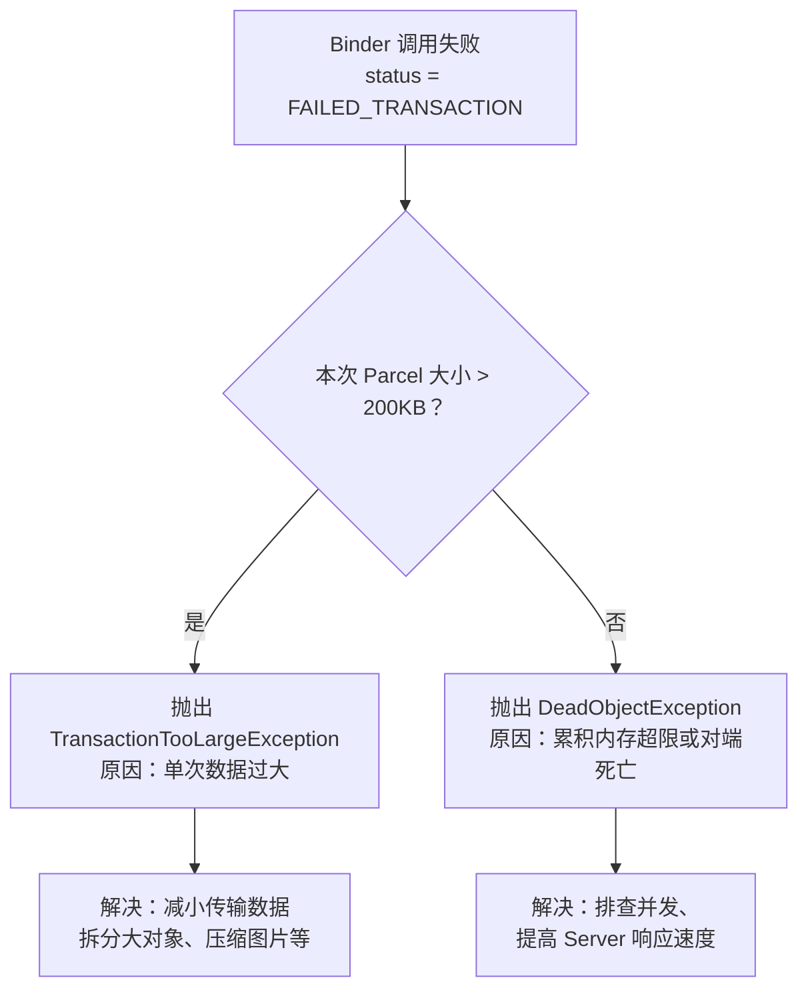
  
### 8.4 Binder 风暴（Binder Storm）  
  
当大量 Binder 请求同时涌入时，会出现"Binder 风暴"：  
  
- 所有 Binder 线程被占满（默认 16 个）  
- 新请求在 `waitForResponse` 中阻塞  
- 如果发生在主线程 → ANR  
  
结合我们项目代码理解：`binder_call()` 中的 `for(;;)` 循环就是在等待回复，如果 Server 端处理慢，Client 就会一直阻塞在这里：  
  
```c  
// binder.c - binder_call()  
for (;;) {  
    // 这里会阻塞！直到驱动返回数据  
    res = ioctl(bs->fd, BINDER_WRITE_READ, &bwr);
    res = binder_parse(bs, reply, ...);
    if (res == 0) {
        return 0;  // 收到回复才返回
    }
}  
```  
  
#### 多线程 Binder 线程池  
  
在 AOSP 中，收到 `BR_SPAWN_LOOPER` 时会创建新线程加入线程池。我们的项目实现了同样的机制：  
  
```c  
// binder.c - binder_parse() 中的 BR_SPAWN_LOOPER 处理  
case BR_SPAWN_LOOPER: {  
    struct binder_thread_desc *desc = malloc(sizeof(*desc));

    desc->bs = bs;
    desc->func = func;
    pthread_create(&tid, NULL, binder_thread_routine, desc);
    break;
}  
```  
  
新线程入口函数发送 `BC_REGISTER_LOOPER` 注册自己，然后进入与主线程相同的 ioctl 循环：  
  
```c  
// binder.c - binder_thread_routine()  
static void *binder_thread_routine(void *arg)
{  
    // 向驱动注册：我是一个新的 looper 线程  
    readbuf[0] = BC_REGISTER_LOOPER;  // 区别于主线程的 BC_ENTER_LOOPER
    binder_write(bs, readbuf, sizeof(uint32_t));  

    for (;;) {
        ioctl(bs->fd, BINDER_WRITE_READ, &bwr);
        binder_parse(bs, 0, readbuf, bwr.read_consumed, func);
    }
}  
```  
  
注意 `BC_ENTER_LOOPER`（主线程）和 `BC_REGISTER_LOOPER`（新线程）的区别——驱动用这个来区分"主动进入循环"和"被动创建的线程"。  
  
#### 实战验证：压力测试  
  
项目提供了压力测试来验证这些限制：  
  
```bash  
# 并发 20 个慢请求（每个 sleep 5s），超过 Server 的 16 线程上限  
./run.sh stress  
# 或手动指定并发数  
./test_client /dev/binderfs/mybinder flood 20  
# 发送超大数据，触发 200KB 警告  
./test_client /dev/binderfs/mybinder large
```  
  
预期观察到的现象：  
- **flood 测试**：前 16 个请求被 Server 的 16 个 Binder 线程处理（可以看到不同的 tid），后续请求阻塞等待，总耗时 > 5s  
- **large 测试**：`binder_call()` 打印 `WARNING: large transaction` 日志，如果超过 mmap 大小则返回 `FAILED_TRANSACTION`  
  
### 8.5 实际开发中的应对策略  
  
| 问题 | 解决方案 |  
|------|---------|  
| 单次数据过大 | 减小 Intent/Bundle 数据量；大数据用 ContentProvider 或文件共享 |  
| 累积内存超限 | Server 端提高处理速度，尽快释放 `BC_FREE_BUFFER` |  
| Binder 风暴 | 控制并发调用频率；非关键调用使用 `FLAG_ONEWAY`（异步） |  
| 主线程 ANR | 避免在主线程发起耗时 Binder 调用；使用异步回调 |  
| 对端死亡 | 注册 `DeathRecipient`，收到通知后重连 |  
  
在我们的项目中，`binder_link_to_death()` 就是注册死亡通知的实现：  
  
```c  
// binder.c  
void binder_link_to_death(struct binder_state *bs, uint32_t target,  
                           struct binder_death *death)
{  
    struct {
        uint32_t cmd;
        struct binder_handle_cookie payload;
    } __attribute__((packed)) data;

    data.cmd = BC_REQUEST_DEATH_NOTIFICATION;
    data.payload.handle = target;
    data.payload.cookie = (uintptr_t)death;
    binder_write(bs, &data, sizeof(data));
}  
```  
  
当对端进程死亡时，驱动会发送 `BR_DEAD_BINDER`，`binder_parse()` 中会回调 death 函数：  
  
```c  
// binder.c - binder_parse()  
case BR_DEAD_BINDER: {  
    struct binder_death *death =
        (struct binder_death *)(uintptr_t) * (binder_uintptr_t *)ptr;

    death->func(bs, death->ptr);  // 执行死亡回调
    break;
}  
```  
  
ServiceManager 就是用这个机制来清理已死亡服务的注册信息的。  
  
---  
  
## 9. Binder 通信监控实战  
  
知道了 Binder 会出什么问题，下一步就是如何发现问题。线上环境中 Binder 异常的堆栈往往不能直接指明根因，我们需要一套监控方案来捕获通信细节。  
  
### 9.1 监控的切入点  
  
回顾我们项目中的调用链：  
  
```  
Client 业务代码  
  → binder_call(bs, &msg, &reply, handle, code)  // 用户态库
    → ioctl(bs->fd, BINDER_WRITE_READ, &bwr)     // 系统调用
      → Binder 驱动处理  
```  
  
在 AOSP 的 C++ 层，对应的调用链是：  
  
```  
Java 层 Proxy.transact()
  → android_os_BinderProxy_transact()            // JNI
    → BpBinder::transact(code, data, reply, flags)  // ← 最佳 Hook 点
      → IPCThreadState::transact()
        → IPCThreadState::writeTransactionData()
        → IPCThreadState::waitForResponse()
```  
  
`BpBinder::transact` 是最佳的监控切入点，因为它同时持有：  
- `code`：调用的方法编号  
- `data`（Parcel）：传输的数据，可以获取大小和接口名  
- `flags`：是否为 oneway 调用  
  
### 9.2 四个监控目标  
  
结合项目代码理解每个目标的原理：  
  
**目标 1：监控通信行为（频率 + 堆栈）**  
  
在我们的项目中，每次 `binder_call()` 就是一次 Binder 通信。通过 Hook `BpBinder::transact`，可以统计调用频率、记录堆栈：  
  
```c  
// 概念示意：Hook 后的代理函数  
int32_t bpbinder_transact_hook(void *bpbinder,  
                               uint32_t code, const void *data,
                               void *reply, uint32_t flags)
{  
    // 记录调用时间、频率  
    log_binder_call(code, flags);  
    // 调用原函数  
    int32_t result = original_transact(bpbinder, code, data, reply, flags);  
    return result;
}  
```  
  
**目标 2：监控 Parcel 大小（防止 FAILED_TRANSACTION）**  
  
在我们的项目中，`binder_io` 的数据大小通过指针差计算：  
  
```c  
// binder.c - binder_call() 中  
writebuf.txn.data_size = msg->data - msg->data0;  // ← 这就是 Parcel 大小  
```  
  
在 AOSP 中，对应的是 `Parcel::dataSize()`。通过 `dlsym` 找到这个符号就能获取大小：  
  
```c  
// 监控示意  
size_t parcel_size = parcel_dataSize(data);  // 通过符号调用  
if (parcel_size > WARNING_THRESHOLD) {  // 比如 500KB
    log_warning("Large Binder parcel: %zu bytes", parcel_size);
    capture_stacktrace();
}  
```  
  
**目标 3：获取调用的服务类名**  
  
Binder 通信中通过 InterfaceToken 标识服务接口。在我们的项目中，Client 发送数据时会写入接口名：  
  
```c  
// test_client.c - svcmgr_lookup()  
bio_put_string16_x(&msg, SVC_MGR_NAME);  // "android.os.IServiceManager"  
```  
  
在 AOSP 中，`Parcel::writeInterfaceToken()` 做同样的事。Hook 这个函数，就能建立 Parcel 指针 → 接口名的映射：  
  
```c  
// 概念示意  
std::map<void*, std::string> parcel_interface_map;  
  
int32_t writeInterfaceToken_hook(void *parcel, const char16_t *interface,  
                                 size_t len)
{  
    // 记录：这个 Parcel 对应哪个接口  
    parcel_interface_map[parcel] = utf16_to_utf8(interface, len);  
    return original_writeInterfaceToken(parcel, interface, len);
}  
```  
  
**目标 4：解析具体方法名**  
  
在我们的项目中，`code = 666` 对应 `TEST_SERVER_SAY_HELLO`。在 AIDL 生成的代码中，每个方法都有一个 `TRANSACTION_xxx` 常量：  
  
```java  
// AIDL 生成的 Stub 类中  
public static final int TRANSACTION_sayHello = 666;
```  
  
通过反射读取 `InterfaceName$Stub` 类的静态常量，就能把 code 映射回方法名：  
  
```java  
// 监控代码示意  
public static String resolveMethodName(String interfaceToken, int code) {  
    try {
        Class<?> stubClass = Class.forName(interfaceToken + "$Stub");
        for (Field field : stubClass.getDeclaredFields()) {
            if (Modifier.isStatic(field.getModifiers())
                && field.getType() == int.class
                && field.getName().startsWith("TRANSACTION_")) {
                field.setAccessible(true);
                if ((int) field.get(null) == code) {
                    // TRANSACTION_sayHello → sayHello
                    return field.getName().substring("TRANSACTION_".length());
                }
            }
        }
    } catch (Exception e) {
        /* 类不存在或被混淆 */
    }
    return "unknown(code=" + code + ")";
}  
```  
  
### 9.3 监控架构总览  
  
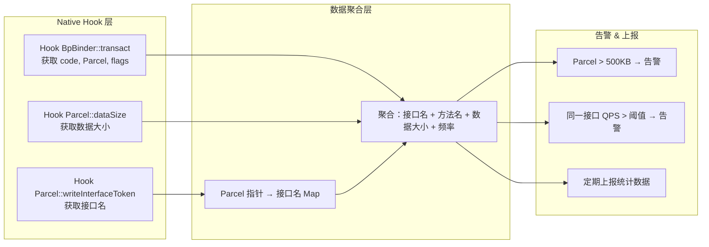
  
### 9.4 从项目代码理解监控原理  
  
我们的项目虽然是 C 层的简化实现，但监控的核心思路完全一致。以 `binder_call()` 为例，如果我们要在项目中加入简单的监控，只需要在调用前后加入统计：  
  
```c  
// 在 binder_call() 中加入监控（示意）  
int binder_call(struct binder_state *bs,  
                struct binder_io *msg, struct binder_io *reply,
                uint32_t target, uint32_t code)
{  
    // 监控：记录数据大小  
    size_t data_size = msg->data - msg->data0;

    fprintf(stderr, "[monitor] target=%d code=%d size=%zu\n",
            target, code, data_size);  
    if (data_size > 500 * 1024) {
        fprintf(stderr, "[monitor] WARNING: large parcel!\n");
    }
    // 原有逻辑...  
    writebuf.cmd = BC_TRANSACTION;
    // ...
}  
```  
  
实际生产环境中，用 PLT/GOT Hook 或 Inline Hook（如 bhook、shadowhook）来实现，不需要修改源码，对 `libbinder.so` 中的符号进行运行时拦截即可。  
  
---  
  
## 10. 动手实战：运行 Demo 项目  
  
### 10.1 环境准备  
  
```bash  
# 需要的工具  
# - Android SDK（含 platform-tools、build-tools）  
# - Android NDK 25.x  
# - JDK 8+  
# - CMake 3.10+  
  
# 设置环境变量  
export ANDROID_HOME=~/android/sdk  
export ANDROID_NDK_HOME=$ANDROID_HOME/ndk/25.1.8937393  
```  
  
### 10.2 创建模拟器  
  
```bash  
# 必须使用 google_apis 镜像（非 playstore），因为需要 root 权限  
sdkmanager "system-images;android-35;google_apis;arm64-v8a"
avdmanager create avd -n binder_test \
    -k "system-images;android-35;google_apis;arm64-v8a" \
    -d pixel_6
```  
  
### 10.3 编译  
  
```bash  
cd android
./build.sh  
```  
  
编译过程：  
1. NDK 交叉编译 C 原生二进制（service_manager, test_server, test_client, binder_ctl）  
2. NDK 编译 JNI 共享库（libbinder_jni.so）  
3. javac 编译 Java 源码  
4. d8 转换为 Android DEX 格式  
  
### 10.4 运行  
  
```bash  
# 启动模拟器  
$ANDROID_HOME/emulator/emulator -avd binder_test &  
adb wait-for-device  
# C 原生测试  
./run.sh native  
# Java JNI 测试  
./run.sh java  
# 压力测试（并发慢请求 + 超大数据）  
./run.sh stress        # C 原生压力测试  
./run.sh stress-java   # Java 压力测试  
```  
  
### 10.5 手动分终端调试  
  
如果想分别观察每个进程的输出，可以打开三个终端：  
  
```bash  
REMOTE=/data/local/tmp/binder  
BDEV=/dev/binderfs/mybinder  
  
# 先获取 root 并创建自定义 binder 设备  
adb root
adb shell $REMOTE/binder_ctl mybinder  
# 终端 1：启动 ServiceManager
adb shell $REMOTE/service_manager $BDEV  
# 终端 2：启动 Server
adb shell $REMOTE/test_server $BDEV  
# 终端 3：启动 Client（支持 hello / flood / large 模式）  
adb shell $REMOTE/test_client $BDEV hello
adb shell $REMOTE/test_client $BDEV flood 20   # 20 个并发慢请求  
adb shell $REMOTE/test_client $BDEV large       # 超大数据测试  
```  
  
预期输出（hello 模式）：  
  
```  
# ServiceManager 终端  
result: 0  
binder: opened /dev/binderfs/mybinder, mmap size=1040384, max threads=15  
service manager start loop  
  
# Server 终端  
binder: opened /dev/binderfs/mybinder, mmap size=1040384, max threads=15  
[server] handler code=666 on tid=xxxx  
[server] say_hello on tid=xxxx  
  
# Client 终端  
=== Binder Test Client ===  
driver: /dev/binderfs/mybinder, mode: hello  
found service 'hello' handle=1  
[client] reply from server: Flavio    ← 成功收到 Server 的回复！  
```  
  
预期输出（flood 模式，20 个并发）：  
  
```  
=== FLOOD TEST: 20 concurrent SLOW_CALL requests ===  
Server has max 16 binder threads.  
Each SLOW_CALL sleeps 5s, holding driver memory.  
  
[flood-0] calling SLOW_CALL on tid=xxxx...  
[flood-1] calling SLOW_CALL on tid=xxxx...  
...  
# 前 16 个请求被 Server 的 16 个 Binder 线程处理（不同 tid）  
# 后 4 个请求阻塞等待，直到前面的请求完成释放线程  
[flood-0] reply: slow_done  
...  
=== FLOOD TEST done ===  
```  
  
> **为什么要创建自定义 binder 设备？** 系统自带的 ServiceManager 已经占用了 `/dev/binder`，我们通过 `binder_ctl` 在 binderfs 中创建独立的设备 `/dev/binderfs/mybinder`，这样我们的三个进程可以在自己的"小世界"里通信，不会干扰系统。  
  
---  
  
## 11. 总结与进阶  

### 11.2 本项目代码与 AOSP 的对应关系  
  
| 本项目文件 | AOSP 对应位置 | 说明 |  
|-----------|--------------|------|  
| `binder.c/h` | `frameworks/native/cmds/servicemanager/binder.c` | 用户态 Binder 库（C 版本） |  
| `service_manager.c` | `frameworks/native/cmds/servicemanager/service_manager.c` | 旧版 ServiceManager（Android 10 前） |  
| `test_server.c` / `test_client.c` | `frameworks/native/cmds/servicemanager/bctest.c` | 测试工具 |  
| Java Stub/Proxy | AIDL 编译器自动生成 | `out/target/.../IXxxService.java` |  
| — | `frameworks/native/libs/binder/` | C++ 版 Binder 库（BpBinder/BBinder/IPCThreadState） |  
| — | `frameworks/base/core/java/android/os/Binder.java` | Java 层 Binder 基类 |  
  
> **注意：** Android 11+ 的 ServiceManager 已经用 C++ 重写（`ServiceManager.cpp`），使用 AIDL 接口而非手写的 C 代码。但底层原理完全一致。  
  
### 11.3 进阶阅读方向  
  
1. **Binder 驱动源码**：`drivers/android/binder.c`（Linux 内核），理解 `binder_thread_write` / `binder_thread_read` 的实现  
2. **C++ Binder 库**：`frameworks/native/libs/binder/`，理解 `BpBinder`（Proxy）、`BBinder`（Stub）、`IPCThreadState`（线程级 Binder 状态）  
3. **Binder 线程池**：Server 端如何管理多个 Binder 线程来并发处理请求（本项目已实现 `BR_SPAWN_LOOPER` → `pthread_create` 的多线程模型）  
4. **Binder 异常处理**：`DeadObjectException`、`TransactionTooLargeException` 等  
5. **Binder 通信监控**：`systrace`、`binder_transaction` tracepoint  
  
---  
  
> 本文所有代码均来自项目仓库，可在 Android 模拟器上实际编译运行。建议读者在阅读本文的同时，动手运行 Demo，通过修改代码来加深理解。比如：  
> - 修改 `test_server.c` 中 `say_hello()` 的返回值，观察 Client 的输出变化  
> - 运行 `./run.sh stress` 观察多线程 Binder 线程池的行为，以及线程池耗尽时的现象  
> - 调整 `test_client.c` 中 flood 的并发数（如 `./test_client $BDEV flood 30`），观察超过 16 线程上限后的阻塞行为  
> - 在 `binder.c` 中打开 `#define TRACE 1`，观察完整的 BC/BR 命令交互日志  
> - 尝试注册多个服务，理解 ServiceManager 的服务管理机制
