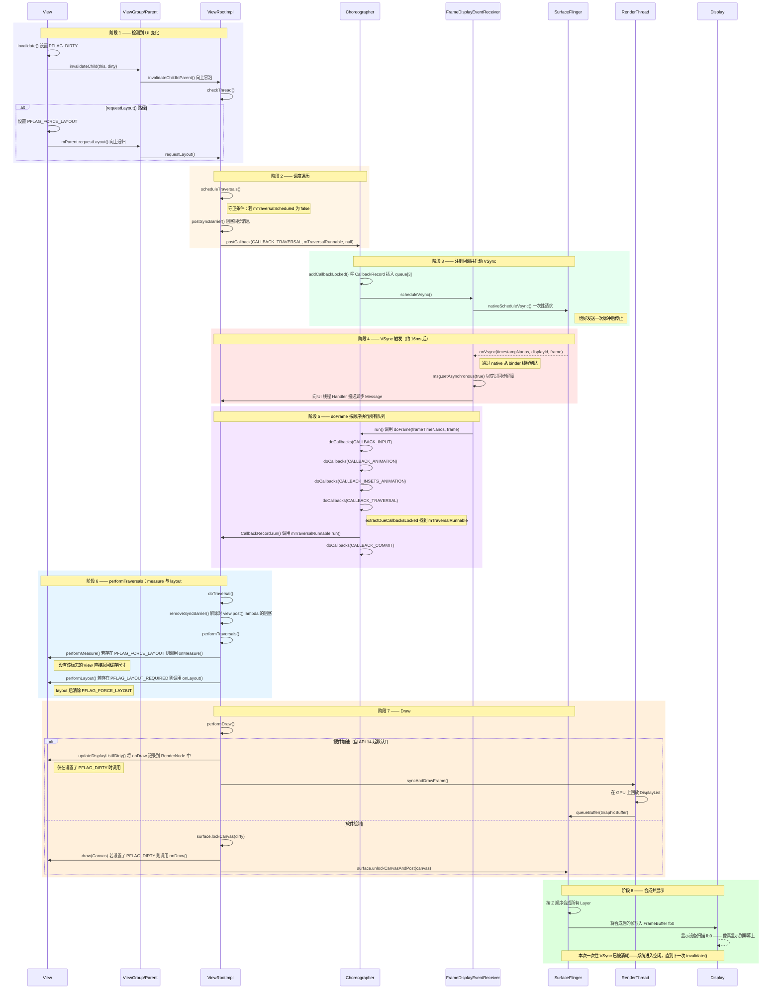

> 基于 Android 视图系统与 AOSP 常见实现整理。本文覆盖从 `invalidate()` / `requestLayout()` 开始，到 `performTraversals()`、`onDraw()`、`SurfaceFlinger` 合成显示为止的完整链路。


## 1. 概述

当 Android 中某个 `View` 发生变化时，屏幕像素并不会立刻更新。系统会经过一条精心编排的流水线，这条流水线横跨多个组件与线程。

这条流水线背后的核心设计目标包括：

- **无撕裂（No tearing）** —— 应用不会在显示器正在读取像素时写入像素
- **无多余工作（No unnecessary work）** —— 除非带有正确的脏标志，否则 View 会跳过 measure / layout / draw
- **电池效率（Battery efficiency）** —— VSync 是一次性的；空闲 UI 不消耗 CPU
- **顺序正确（Correct ordering）** —— 始终是 input → animation → traversal

这些目标与 Android 图形栈中 `ViewRootImpl`、`Choreographer`、`View`、`ViewGroup` 的职责划分是一致的。`MeasureSpec` 负责表达父对子测量约束，`View` 负责测量、布局和绘制的核心阶段，`Choreographer` 则协调帧时序。

### 完整时序图

下图覆盖了整个过程中涉及的所有组件——从一个 `View` 调用 `invalidate()` 或 `requestLayout()` 的那一刻开始，一直到像素最终出现在屏幕上。



---

## 2. 第 1 步——View 请求重绘

Android 中每一次 UI 更新，都是从某个 `View` 上的以下两种调用之一开始的：

### `invalidate()` —— 只有外观发生变化

```java
// View.java
public void invalidate(boolean invalidateCache) {
    invalidateInternal(0, 0, mRight - mLeft, mBottom - mTop,
            invalidateCache, true);
}

void invalidateInternal(...) {
    // 仅将“当前这个 View”标记为需要重绘
    mPrivateFlags |= PFLAG_DIRTY;

    // 将脏区域通过父节点逐级向上冒泡
    final ViewParent p = mParent;
    if (p != null && ai != null) {
        p.invalidateChild(this, damage);
    }
}
```

`PFLAG_DIRTY` 只会把该 View 标记为需要重绘。它**不会**触发 measure 或 layout。  
当只有视觉外观发生变化时使用它，例如颜色变化、文本变化但尺寸不变。

### `requestLayout()` —— 尺寸或位置可能发生变化

```java
// View.java
public void requestLayout() {
    // 将此 View 标记为需要重新测量 + 重新布局
    mPrivateFlags |= PFLAG_FORCE_LAYOUT;
    mPrivateFlags |= PFLAG_INVALIDATED;

    // 向上递归经过每一个祖先
    if (mParent != null && !mParent.isLayoutRequested()) {
        mParent.requestLayout();
    }
}
```

`PFLAG_FORCE_LAYOUT` 会一直传播到 `ViewRootImpl`。直接路径上的每个祖先都会被打标志。兄弟节点和其他旁系节点不会受到影响。

### 标志位传播示例

在如下树结构中调用 `TextView.requestLayout()`：

```text
DecorView       ← PFLAG_FORCE_LAYOUT  （祖先，向上冒泡得到）
  LinearLayout  ← PFLAG_FORCE_LAYOUT  （祖先，向上冒泡得到）
    TextView    ← PFLAG_FORCE_LAYOUT + PFLAG_DIRTY  （源头）
    ImageView   ← （无标志——兄弟节点，不受影响）
```

### 两条路径最终都会到达同一个地方

无论是 `invalidate()` 还是 `requestLayout()`，递归最终都会到达 `ViewRootImpl`：

```java
// ViewRootImpl.java
@Override
public ViewParent invalidateChildInParent(int[] location, Rect dirty) {
    checkThread();          // 必须在 UI 线程
    invalidateRectOnScreen(dirty);
    // ↓
    scheduleTraversals();   // 相同的终点
}

@Override
public void requestLayout() {
    checkThread();
    mLayoutRequested = true;
    scheduleTraversals();   // 相同的终点
}
```

### `invalidate()` vs `requestLayout()` —— 成本对比

| 调用 | Measure | Layout | Draw |
|---|---|---|---|
| `invalidate()` | 跳过 | 跳过 | 仅变更的 View |
| `requestLayout()` | 变更的 View + 所有祖先 | 变更的 View + 所有祖先 | 仅变更的 View |
| 两者都调用 | 变更的 View + 所有祖先 | 变更的 View + 所有祖先 | 变更的 View + 所有祖先 |

**经验法则：** 当尺寸不变时，优先使用 `invalidate()`。`requestLayout()` 代价明显更高，因为它会强制从当前节点一直到根节点的每个祖先都执行 `onMeasure()`。

---

## 3. 第 2 步——scheduleTraversals() 与同步屏障

```java
// ViewRootImpl.java
void scheduleTraversals() {
    if (!mTraversalScheduled) {          // 守卫：每帧只注册一次
        mTraversalScheduled = true;

        // ① 投递一个同步屏障——阻塞 UI 线程上的所有普通（同步）消息
        mTraversalBarrier =
                mHandler.getLooper().getQueue().postSyncBarrier();

        // ② 向 Choreographer 注册绘制回调
        mChoreographer.postCallback(
                Choreographer.CALLBACK_TRAVERSAL,
                mTraversalRunnable,
                null);
    }
}
```

这里会发生两件事：

**同步屏障（sync barrier）** 是一种特殊消息，它没有 target，会阻止 Looper 处理之后到来的同步消息；异步消息可以穿过它。这样可以把 UI 线程在当前帧开始到绘制完成之间的工作尽量收束到“为这一帧服务”的范围内。

**为什么这个屏障会影响 `view.post(Runnable)`：** 通过 `view.post()` 投递的 `Runnable` 属于同步消息。它会停留在屏障后面，直到 `performTraversals()` 完成并移除屏障之后才会执行。这正是 `view.post { view.width }` 能可靠获得正确值的关键原因。

**`mTraversalScheduled` 这个布尔守卫** 保证无论一帧内调用多少次 `invalidate()`，最终只会有一个 `CallbackRecord` 进入 Choreographer 队列。这个标志会在帧完成后，在 `doTraversal()` 中重置。

---

## 4. 第 3 步——Choreographer 与 VSync

### 为什么需要 VSync

显示设备会以固定速率自上而下刷新——常见是 60Hz，新设备也可能是 90Hz、120Hz。它有自己的硬件时钟，不会等待应用。没有同步时，应用若在显示器扫描旧帧期间写入新帧，就会产生撕裂。

**VSync** 是显示刷新周期开始时的硬件脉冲。它告诉应用：“旧帧读完了，现在可以准备下一帧。” Android 的 `Choreographer` 就是围绕这个时机组织输入、动画与遍历回调的。

### Choreographer 的作用

`Choreographer` 是一个协调器，它将原始的 VSync 脉冲转换成结构化的一系列回调。它维护着 5 个回调队列：

```java
// Choreographer.java
public static final int CALLBACK_INPUT            = 0;
public static final int CALLBACK_ANIMATION        = 1;
public static final int CALLBACK_INSETS_ANIMATION = 2;
public static final int CALLBACK_TRAVERSAL        = 3;
public static final int CALLBACK_COMMIT           = 4;
```

VSync 到来时，Choreographer 会按固定顺序依次执行这些队列：**输入 → 动画 → Insets 动画 → Traversal → Commit**。这样每一帧在因果关系上都是一致的。

### VSync 是一次性的

`scheduleVsync()` 注册的是一次性监听。一次脉冲送达后，这次注册就被消费；若还需要下一帧，必须重新注册。这样静态界面不会白白占用 CPU，而连续动画则在每帧回调中重新申请下一次 VSync。

---

## 5. 第 4 步——回调注册路径

从：

`mChoreographer.postCallback(CALLBACK_TRAVERSAL, mTraversalRunnable, null)`

开始。

### `postCallbackDelayedInternal()` —— 一把锁下完成两件事

```java
// Choreographer.java
private void postCallbackDelayedInternal(int callbackType,
        Object action, Object token, long delayMillis) {
    synchronized (mLock) {
        final long now = SystemClock.uptimeMillis();
        final long dueTime = now + delayMillis;

        // ① 包装成 CallbackRecord 并插入到正确队列
        mCallbackQueues[callbackType].addCallbackLocked(dueTime, action, token);

        // ② 启动一次性 VSync 监听器
        if (dueTime <= now) {
            scheduleFrameLocked(now);
        }
    }
}
```

### `addCallbackLocked()` —— 按 dueTime 插入有序链表

```java
// Choreographer.java — CallbackQueue 内部
public void addCallbackLocked(long dueTime, Object action, Object token) {
    CallbackRecord callback = obtainCallbackLocked(dueTime, action, token);
    // callback.action = mTraversalRunnable
    // callback.token  = null
    // callback.dueTime = now

    // 按 dueTime 顺序插入
    // ... 链表插入逻辑 ...
}
```

插入后状态大致如下：

```text
mCallbackQueues[3]  (CALLBACK_TRAVERSAL)
  └── CallbackRecord
        .action  = mTraversalRunnable
        .token   = null
        .dueTime = <now>
        .next    = null
```

### `scheduleFrameLocked()` → `scheduleVsync()`

```java
// Choreographer.java
private void scheduleFrameLocked(long now) {
    if (!mFrameScheduled) {
        mFrameScheduled = true;
        if (USE_VSYNC) {
            mDisplayEventReceiver.scheduleVsync();
        }
    }
}
```

### 同一类型可以有多个回调

`doCallbacks()` 会一次提取所有到期记录：

```java
void doCallbacks(int callbackType, long frameTimeNanos) {
    CallbackRecord callbacks =
        mCallbackQueues[callbackType].extractDueCallbacksLocked(now);

    for (CallbackRecord c = callbacks; c != null; c = c.next) {
        c.run(frameTimeNanos);
    }
}
```

`CALLBACK_TRAVERSAL` 几乎总是一个；`CALLBACK_ANIMATION` 往往可能有多个，例如多个 `ValueAnimator` 并发运行时。它们会共享同一个 `frameTimeNanos`。

---

## 6. 第 5 步——VSync 触发：通往 performTraversals() 的调用链

```text
Native SurfaceFlinger
  │  通过 socket/fd 发出 VSync 脉冲
  ▼
FrameDisplayEventReceiver.onVsync()        ← 通过 JNI 在 binder 线程被调用
  │  向 UI 线程 Handler 投递异步 Message
  ▼
FrameDisplayEventReceiver.run()            ← Looper 处理该 Message
  │
  ▼
Choreographer.doFrame()                    ← 按顺序执行全部 5 个队列
  │  doCallbacks(CALLBACK_INPUT)
  │  doCallbacks(CALLBACK_ANIMATION)
  │  doCallbacks(CALLBACK_INSETS_ANIMATION)
  │  doCallbacks(CALLBACK_TRAVERSAL)
  ▼
CallbackRecord.run()
  │  token == null → ((Runnable) action).run()
  ▼
TraversalRunnable.run()
  ▼
ViewRootImpl.doTraversal()
  │  removeSyncBarrier()
  ▼
ViewRootImpl.performTraversals()
```

### 为什么 `onVsync()` 要 post Message，而不是直接调 `doFrame()`

因为 `onVsync()` 来自 binder 线程，而 `performTraversals()` 必须在创建 `ViewRootImpl` 的 UI 线程中运行。

### 为什么这个 Message 必须是异步的

因为前面已经设置了同步屏障；若 VSync 递送消息仍是同步的，它就会被屏障挡住，导致系统死锁。

### 为什么 `removeSyncBarrier()` 必须放在 `doTraversal()` 里

因为屏障必须从“决定要画”这一刻持续到“真正开始 performTraversals”这一刻，防止 `view.post()` 的同步消息提前插入。

---

## 7. 第 6 步——performTraversals()：Measure、Layout、Draw

这一部分是整条 View 绘制链路的核心。这里把 `Measure → Layout → Draw` 三阶段进一步展开到更细粒度，便于博客阅读与知识体系化理解。

### 6.1 总入口：performTraversals()

```java
// ViewRootImpl.java
private void performTraversals() {
    // 仅首帧：将 AttachInfo 分发给所有 View
    if (mFirst) {
        host.dispatchAttachedToWindow(mAttachInfo, 0);
    }

    performMeasure(childWidthMeasureSpec, childHeightMeasureSpec);
    performLayout(lp, mWidth, mHeight);
    performDraw();
}
```

`performTraversals()` 是三大阶段的统一入口：**Measure → Layout → Draw**。整棵 View 树都从 `DecorView` 开始，自顶向下递归。

### 6.2 三阶段总览：Measure → Layout → Draw

每当一个 View 需要显示到屏幕上，框架都会按顺序运行三个阶段：

```text
Measure  →  Layout  →  Draw
```

它们分别解决三个不同问题：

- **Measure**：每个 View 决定“自己想要多大”
- **Layout**：每个 View 记录“自己最终放在哪里”
- **Draw**：每个 View 按最终位置和尺寸把内容画到 Canvas 上

### 6.3 Measure 阶段：测量规则与 MeasureSpec

**目标：** 每个 View 计算出自己的宽和高。

#### MeasureSpec

`MeasureSpec` 会把两个值打包进一个 `int`（32 位）里：高 2 位表示 **mode**，低 30 位表示 **size**。

| Mode | 值 | 含义 |
|---|---|---|
| `UNSPECIFIED` | `0` | 没有限制，View 可以任意大 |
| `EXACTLY` | `1` | 精确尺寸：`match_parent` 或固定 dp |
| `AT_MOST` | `2` | 最大尺寸：常见于 `wrap_content`，不能超过父容器 |

```java
MeasureSpec.makeMeasureSpec(size, mode);  // 打包
MeasureSpec.getMode(spec);                // 解出 mode
MeasureSpec.getSize(spec);                // 解出 size
```

#### spec 如何从父节点流向子节点

**第 1 步——ViewRootImpl 为根节点构建 spec**

```java
// ViewRootImpl.java
private void performTraversals() {
    int childWidthMeasureSpec  = getRootMeasureSpec(mWidth,  lp.width);
    int childHeightMeasureSpec = getRootMeasureSpec(mHeight, lp.height);
    performMeasure(childWidthMeasureSpec, childHeightMeasureSpec);
}

// DecorView 默认是 match_parent → 总是 EXACTLY + 屏幕尺寸
private void performMeasure(int w, int h) {
    mView.measure(w, h);   // mView = DecorView
}
```

**第 2 步——ViewGroup.onMeasure() 调 measureChildWithMargins()**

```java
// FrameLayout.java
protected void onMeasure(int widthMeasureSpec, int heightMeasureSpec) {
    for (int i = 0; i < count; i++) {
        final View child = getChildAt(i);
        if (child.getVisibility() != GONE) {
            measureChildWithMargins(child, widthMeasureSpec, 0, heightMeasureSpec, 0);
        }
    }
}
```

**第 3 步——measureChildWithMargins() 会扣除 padding + margin**

```java
// ViewGroup.java
protected void measureChildWithMargins(View child,
        int parentWidthMeasureSpec,  int widthUsed,
        int parentHeightMeasureSpec, int heightUsed) {

    final MarginLayoutParams lp = (MarginLayoutParams) child.getLayoutParams();

    final int childWidthMeasureSpec = getChildMeasureSpec(
        parentWidthMeasureSpec,
        mPaddingLeft + mPaddingRight + lp.leftMargin + lp.rightMargin + widthUsed,
        lp.width
    );
    final int childHeightMeasureSpec = getChildMeasureSpec(
        parentHeightMeasureSpec,
        mPaddingTop + mPaddingBottom + lp.topMargin + lp.bottomMargin + heightUsed,
        lp.height
    );

    child.measure(childWidthMeasureSpec, childHeightMeasureSpec);
}
```

**第 4 步——getChildMeasureSpec() 是核心翻译表**

子 View 最终拿到的 MeasureSpec = **父 spec + 子 LayoutParams + 可用空间扣减**。

```java
// ViewGroup.java
public static int getChildMeasureSpec(int spec, int padding, int childDimension) {
    int specMode = MeasureSpec.getMode(spec);
    int specSize = MeasureSpec.getSize(spec);
    int size = Math.max(0, specSize - padding);

    switch (specMode) {
        case MeasureSpec.EXACTLY:
            if (childDimension >= 0)                   return EXACTLY + childDimension;
            if (childDimension == MATCH_PARENT)        return EXACTLY + size;
            if (childDimension == WRAP_CONTENT)        return AT_MOST + size;

        case MeasureSpec.AT_MOST:
            if (childDimension >= 0)                   return EXACTLY + childDimension;
            if (childDimension == MATCH_PARENT)        return AT_MOST + size;
            if (childDimension == WRAP_CONTENT)        return AT_MOST + size;

        case MeasureSpec.UNSPECIFIED:
            if (childDimension >= 0)                   return EXACTLY + childDimension;
            else                                       return UNSPECIFIED + 0;
    }
}
```

可以总结成下面这张表：

| 父 mode | 子 LayoutParams | 子 mode | 子 size |
|---|---|---|---|
| EXACTLY | 固定 dp | EXACTLY | childDimension |
| EXACTLY | match_parent | EXACTLY | parent size |
| EXACTLY | wrap_content | AT_MOST | parent size |
| AT_MOST | 固定 dp | EXACTLY | childDimension |
| AT_MOST | match_parent | AT_MOST | parent size |
| AT_MOST | wrap_content | AT_MOST | parent size |
| UNSPECIFIED | 任意 | UNSPECIFIED | 0 |

#### setMeasuredDimension() —— 每个节点都必须调用

每个 `View` 和 `ViewGroup` 都必须在 `onMeasure()` 返回前调用 `setMeasuredDimension()`。框架会强制检查：

```java
// View.java
public final void measure(int widthMeasureSpec, int heightMeasureSpec) {
    onMeasure(widthMeasureSpec, heightMeasureSpec);

    // 如果从未调用 setMeasuredDimension()，会直接崩溃
    if ((mPrivateFlags & PFLAG_MEASURED_DIMENSION_SET) == 0) {
        throw new IllegalStateException("did not call setMeasuredDimension()");
    }
}
```

对 `ViewGroup` 来说，`onMeasure()` 内部的典型顺序是：

```text
1. 先 measure 所有子 View（拿到它们的 measuredWidth/Height）
2. 结合子 View、自己的 padding、最小尺寸，计算 maxWidth/maxHeight
3. 通过 resolveSizeAndState() 与自己的 MeasureSpec 做最终协调
4. 调用 setMeasuredDimension(finalW, finalH)
```

```java
// FrameLayout.java — 简化
protected void onMeasure(int widthMeasureSpec, int heightMeasureSpec) {
    for (int i = 0; i < count; i++) {
        measureChildWithMargins(child, widthMeasureSpec, 0, heightMeasureSpec, 0);
        maxWidth  = Math.max(maxWidth,  child.getMeasuredWidth()  + lp.leftMargin + lp.rightMargin);
        maxHeight = Math.max(maxHeight, child.getMeasuredHeight() + lp.topMargin  + lp.bottomMargin);
    }
    maxWidth  += getPaddingLeft() + getPaddingRight();
    maxHeight += getPaddingTop()  + getPaddingBottom();
    maxWidth  = Math.max(maxWidth,  getSuggestedMinimumWidth());
    maxHeight = Math.max(maxHeight, getSuggestedMinimumHeight());

    setMeasuredDimension(
        resolveSizeAndState(maxWidth,  widthMeasureSpec,  childState),
        resolveSizeAndState(maxHeight, heightMeasureSpec, childState)
    );
}
```

`resolveSizeAndState()` 的最终协调逻辑可以概括为：

| 自己的 specMode | 最终尺寸 |
|---|---|
| EXACTLY | 总是 `specSize` |
| AT_MOST | `min(maxWidth, specSize)` |
| UNSPECIFIED | 自由采用 `maxWidth` |

#### getMeasuredWidth() vs getWidth()

| 方法 | 何时可用 | 含义 |
|---|---|---|
| `getMeasuredWidth()` | `onMeasure()` 之后 | View “想要”的尺寸 |
| `getWidth()` | `onLayout()` 之后 | View “最终实际”的尺寸 |

通常二者相等，但 **`getWidth()` 才是权威值**。在 `onDraw()` 中不要使用 `getMeasuredWidth()`。

#### 自定义 View 的规则

默认 `onMeasure()` 往往会让 `AT_MOST` 和 `EXACTLY` 看起来都像直接使用 `specSize`，因此如果你不重写，自定义 View 的 `wrap_content` 很容易表现得像 `match_parent`。正确做法是显式处理自己的“自然尺寸”。

```java
@Override
protected void onMeasure(int widthMeasureSpec, int heightMeasureSpec) {
    int desiredW = 200;
    int desiredH = 200;

    int w = resolveSize(desiredW, widthMeasureSpec);
    int h = resolveSize(desiredH, heightMeasureSpec);
    setMeasuredDimension(w, h);
}
```

### 6.4 Layout 阶段：记录最终位置与尺寸

**目标：** 每个 View 记录自己在父容器中的精确位置。

#### 真正被记录的是什么——setFrame()

```java
// View.java
protected boolean setFrame(int left, int top, int right, int bottom) {
    mLeft   = left;
    mTop    = top;
    mRight  = right;
    mBottom = bottom;

    mRenderNode.setLeftTopRightBottom(mLeft, mTop, mRight, mBottom);

    if (sizeChanged) {
        sizeChange(newWidth, newHeight, oldWidth, oldHeight);  // → onSizeChanged()
    }
}
```

这四个值都是**相对于父容器**的，不是相对于屏幕。

由它们可以得到：

```java
getWidth()  = mRight  - mLeft
getHeight() = mBottom - mTop
getLeft()   = mLeft
getTop()    = mTop
```

#### layout() 调用链

```java
// View.java
public void layout(int l, int t, int r, int b) {
    boolean changed = setFrame(l, t, r, b);
    if (changed || ...) {
        onLayout(changed, l, t, r, b);
    }
}
```

- `View` 里的 `onLayout()` 为空实现，因为叶子节点通常不需要布局子节点
- `ViewGroup` 必须实现 `onLayout()`，因为容器要负责摆放自己的 children

#### ViewGroup.onLayout() 示例——FrameLayout

```java
// FrameLayout.java
void layoutChildren(int left, int top, int right, int bottom, ...) {
    for (int i = 0; i < count; i++) {
        final View child = getChildAt(i);
        final int width  = child.getMeasuredWidth();
        final int height = child.getMeasuredHeight();

        // 根据 gravity + margin + padding 计算 childLeft / childTop
        ...

        child.layout(childLeft, childTop, childLeft + width, childTop + height);
    }
}
```

#### onSizeChanged()

当 `setFrame()` 发现宽高变化时，会触发 `onSizeChanged()`。这是自定义 View 缓存几何信息的最佳位置：

```java
@Override
protected void onSizeChanged(int w, int h, int oldw, int oldh) {
    super.onSizeChanged(w, h, oldw, oldh);
    mCenterX = w / 2f;
    mCenterY = h / 2f;
    mRadius  = Math.min(w, h) / 2f;
}
```

### 6.5 Draw 阶段：Canvas、translate、clip 与 onDraw()

**目标：** 每个 View 把自己画到 Canvas 上。

#### draw 阶段会消费哪些前序阶段的结果

| 来源 | 使用的值 | 在 draw 中的用途 |
|---|---|---|
| Layout | `mLeft`, `mTop` | `canvas.translate()`，把画布原点平移到 View 位置 |
| Layout | `mRight - mLeft`, `mBottom - mTop` | `canvas.clipRect()`，裁剪到当前 View 边界 |
| Layout | `getWidth()`, `getHeight()` | 在 `onDraw()` 中用于计算绘制位置 |
| Measure | `getMeasuredWidth/Height` | 不直接参与 draw，layout 已经消费过它们 |

#### View 上有两个 draw()，不要混淆

| 方法 | 可见性 | 谁调用 | 做什么 |
|---|---|---|---|
| `draw(Canvas, ViewGroup, long)` | 包级内部 | `ViewGroup.drawChild()` | 处理 translate + clip，再调用 public draw |
| `draw(Canvas)` | public | 框架 | 调 `onDraw()`、`dispatchDraw()`、装饰绘制 |

#### Canvas 的平移完全由框架完成

```java
// View.java — 内部实现，不需要你调用或重写
boolean draw(Canvas canvas, ViewGroup parent, long drawingTime) {

    int restoreTo = canvas.save();

    canvas.translate(mLeft, mTop);
    canvas.clipRect(0, 0, getWidth(), getHeight());

    draw(canvas);

    canvas.restoreToCount(restoreTo);
    return more;
}
```

#### 完整 draw 调用链

```text
ViewRootImpl.performDraw()
  └─ drawSoftware()
       └─ DecorView.draw(canvas)           // public draw()
            ├─ onDraw(canvas)              // DecorView 自己的背景等
            └─ dispatchDraw(canvas)        // 遍历子节点
                 └─ drawChild(canvas, child, drawingTime)
                      └─ child.draw(canvas, this, drawingTime)   // internal draw()
                           ├─ canvas.save()
                           ├─ canvas.translate(mLeft, mTop)
                           ├─ canvas.clipRect(0, 0, w, h)
                           ├─ child.draw(canvas)                 // public draw()
                           │    ├─ drawBackground()
                           │    ├─ onDraw(canvas)                // 你的代码
                           │    └─ dispatchDraw()                // 若是 ViewGroup 则继续递归
                           └─ canvas.restoreToCount()
```

#### 在 onDraw() 内部是什么坐标系

因为框架已经提前做了 `canvas.translate(mLeft, mTop)`，所以在 `onDraw()` 内部，`(0, 0)` 永远表示**当前 View 自己的左上角**。你不需要关心屏幕坐标。

```java
@Override
protected void onDraw(Canvas canvas) {
    float cx = getWidth()  / 2f;
    float cy = getHeight() / 2f;

    canvas.drawCircle(cx, cy, Math.min(cx, cy), mPaint);
    canvas.drawRect(0, 0, getWidth(), getHeight(), mBorderPaint);
}
```

#### 为什么需要 canvas.save() / restoreToCount()

因为同一个 `Canvas` 会在整个 View 树中共享。save / restore 能确保一个子 View 的平移、裁剪、变换不会泄漏到兄弟节点：

```text
parent dispatchDraw
  ├─ child A: save → translate(A.mLeft, A.mTop) → draw → restore
  ├─ child B: save → translate(B.mLeft, B.mTop) → draw → restore
  └─ child C: save → translate(C.mLeft, C.mTop) → draw → restore
```

### 6.6 硬件绘制路径 vs 软件绘制路径

`performDraw()` 会根据是否启用硬件加速走不同路径：

```java
// ViewRootImpl.java
private boolean draw(boolean fullRedrawNeeded) {
    if (mAttachInfo.mThreadedRenderer != null &&
            mAttachInfo.mThreadedRenderer.isEnabled()) {
        // 硬件路径：构建 DisplayList，并交给 RenderThread 渲染
        mAttachInfo.mThreadedRenderer.draw(mView, mAttachInfo, this);
    } else {
        // 软件路径：直接在 Surface 上 lock 一个 Canvas
        drawSoftware(surface, attachInfo, xoff, yoff, ...);
    }
}
```

**软件绘制：**  
`surface.lockCanvas(dirty)` → 把 Canvas 传给每个 View → `surface.unlockCanvasAndPost(canvas)`  
全部运行在 UI 线程。

**硬件绘制：**  
每个 View 会把自己的绘制命令记录到 `RenderNode` / `DisplayList` 中；UI 线程负责录制，`RenderThread` 负责在 GPU 上回放。

### 6.7 自定义 View 生命周期中的关键回调顺序

一个典型自定义 View 的关键回调顺序如下：

```text
onAttachedToWindow()       ← View 被附着到 Window
onVisibilityChanged()      ← 至少一次，可能多次
onMeasure()                ← measure 阶段
onSizeChanged()            ← 首次以及每次尺寸变化时
onLayout()                 ← layout 阶段（通常是 ViewGroup 更关心）
onDraw()                   ← draw 阶段，invalidate() 后可重复触发
onDetachedFromWindow()     ← View 被移除，适合清理资源
```

### 6.8 自定义 View 开发规则

1. **在 `onMeasure()` 中一定要调用 `setMeasuredDimension()`**，否则会崩溃。  
2. **重写 `onMeasure()`**，正确处理 `wrap_content`；默认行为往往不符合你的自然尺寸预期。  
3. **使用 `onSizeChanged()` 缓存几何信息**，因为它能拿到最终的 `getWidth()` / `getHeight()`。  
4. **在 `onDraw()` 中使用 `getWidth()` / `getHeight()`**，不要用 `getMeasuredWidth()` / `getMeasuredHeight()`。  
5. **不要在 `onDraw()` 里硬编码像素位置**，应从当前尺寸推导。  
6. **不要担心屏幕绝对坐标**，框架已经帮你把 Canvas 平移到了当前 View 的局部坐标系。  
7. **外观变化调用 `invalidate()`**。  
8. **尺寸或位置变化调用 `requestLayout()`**。  

---

## 8. 第 7 步——基于标志位的选择性执行

这是 Android 绘制系统高效性的核心。树始终会被遍历；但回调并不总会执行。

### 完整示例：简单树中的 `TextView.requestLayout()`

```text
DecorView
  └── LinearLayout
        ├── TextView    ← 在这里调用了 requestLayout()
        └── ImageView
```

**调用 `requestLayout()` 之后：**

| View | PFLAG_FORCE_LAYOUT | PFLAG_DIRTY |
|---|---|---|
| DecorView | ✓（向上冒泡） | — |
| LinearLayout | ✓（向上冒泡） | — |
| TextView | ✓（源头） | ✓（源头） |
| ImageView | — | — |

**`performTraversals()` 中真正会执行的内容：**

| View | onMeasure | onLayout | onDraw |
|---|---|---|---|
| DecorView | ✓ 执行 | ✓ 执行 | — 跳过 |
| LinearLayout | ✓ 执行 | ✓ 执行 | — 跳过 |
| TextView | ✓ 执行 | ✓ 执行 | ✓ 执行 |
| ImageView | — 跳过 | — 跳过 | — 跳过 |

### 为什么父节点必须重新 measure

因为父容器的尺寸与摆放逻辑可能依赖子节点。例如 `LinearLayout` 的高度可能取决于 `TextView` 的新高度；`DecorView` 也可能随之重新放置内容。系统无法提前知道祖先是否完全不受影响，因此必须沿路径向上重新 measure。

### `view.post(Runnable)` 为什么总能拿到正确宽高

```java
// View.java
public boolean post(Runnable action) {
    final AttachInfo attachInfo = mAttachInfo;
    if (attachInfo != null) {
        return attachInfo.mHandler.post(action);
    }
    getRunQueue().post(action);
    return true;
}
```

这是同步消息，会被挡在同步屏障后面；屏障仅在 `doTraversal()` 中、`performTraversals()` 开始前移除，因此这个 `Runnable` 总在当前帧 measure + layout 完成之后执行。

---

## 9. 第 8 步——Surface 与 SurfaceFlinger

### 这个架构要解决的问题

`onDraw()` 运行在应用侧；显示器则持续从缓冲区读取像素。如果应用直接改写当前正在被显示器读取的那块内存，就会产生撕裂。整个 Surface / SurfaceFlinger 架构的目的，就是让“生产帧”和“消费帧”解耦。

### Surface 是什么

`Surface` 是一个缓冲区队列的生产者端句柄。它不是像素内存本身，而是应用获取 `GraphicBuffer` 并提交给 SurfaceFlinger 的入口。

```java
// ViewRootImpl.java — 软件绘制路径（简化）
private boolean drawSoftware(Surface surface, ...) {
    final Canvas canvas;

    canvas = mSurface.lockCanvas(dirty);
    mView.draw(canvas);
    surface.unlockCanvasAndPost(canvas);
}
```

一个 `Window` 只有一个 `Surface`，其下所有普通 View 共用它。

### 共享内存队列与三缓冲

应用与 SurfaceFlinger 通过 `GraphicBuffer` 共享同一组物理内存页，而不是反复复制像素。三缓冲意味着显示器、GPU、CPU 可以并行占用三块不同的 buffer，从而减少等待。

```text
Buffer A  →  显示器正在读取（前台）
Buffer B  →  已渲染完成，等待合成（后台）
Buffer C  →  应用正在写下一帧（空闲）
```

### SurfaceFlinger 的职责

SurfaceFlinger 负责：

1. 管理每个 `Surface` 对应的 Layer  
2. 在 VSync 驱动下获取新的 buffer  
3. 按 Z-order 合成所有 Layer  
4. 将最终结果输出到显示帧缓冲

### SurfaceView：独立 Surface 的例外

普通 View 共享 Window 的 Surface；`SurfaceView` 则拥有独立的 Surface 和独立 Layer。为了让它显示出来，系统会在上层 Window Layer 对应位置“打洞”，让下面的 SurfaceView Layer 透出来。

---

## 10. 关键设计决策总结

### 一次性的 VSync 注册

每次 `scheduleVsync()` 只注册一次脉冲。静态界面不会浪费 CPU；连续动画在每帧里主动续订下一帧。

### 同步屏障 + 异步 VSync 消息

同步屏障阻断普通消息；VSync 递送消息被标记为异步，可以穿过屏障，从而保证当前帧优先完成。

### 标志位控制的回调执行

整棵树会被遍历，但 `onMeasure`、`onLayout`、`onDraw` 只对带标志的节点真正执行，从而把成本控制在变化发生的路径上。

### 所有回调共享同一个时间戳

同一帧中的所有 `CallbackRecord` 都使用相同的 `frameTimeNanos`，所以并行动画即使顺序执行，也能保持同步。

### RenderThread 分离

UI 线程负责录制绘制命令，`RenderThread` 负责 GPU 回放。这让 UI 线程与 GPU 渲染在一定程度上解耦。

### 16ms 预算

在 60fps 下，一帧预算只有 16.67ms；120Hz 下进一步缩小到 8.33ms。任何 measure、layout、draw、GPU 提交超时，都会表现为掉帧和 jank。
