>系统梳理 Kotlin 协程的核心概念、内部机制与最佳实践。


## 一、协程是什么

协程（Coroutine）是 Kotlin 语言级别的特性，编译器为其提供了专门的支持和优化。协程的本质是**一个可挂起的计算实例**——它可以在某些点暂停执行，稍后在可能不同的线程上恢复。

### 核心工作原理

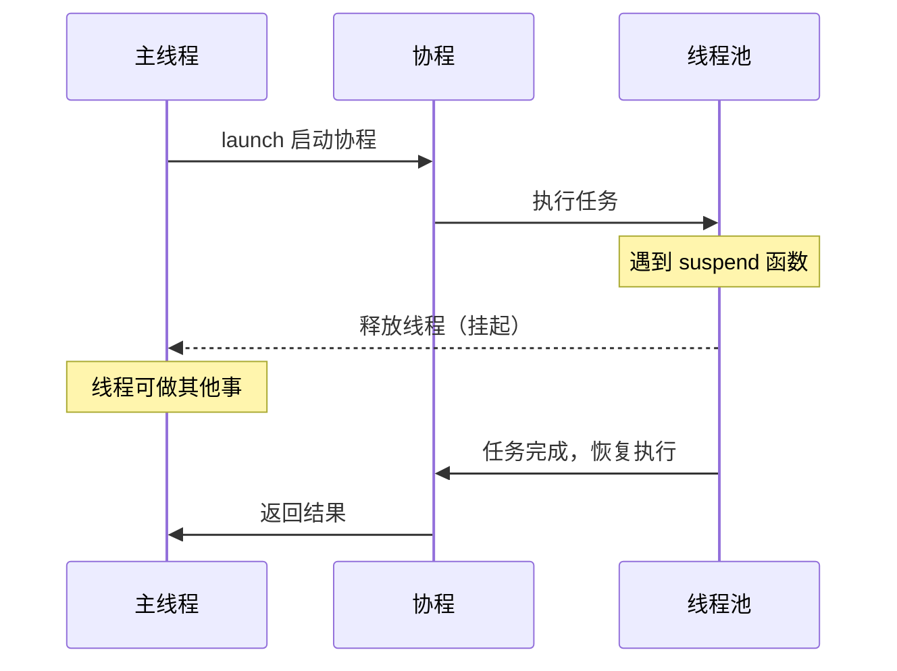

### 关键特征

- **轻量级**：协程在用户空间管理，创建成本极低（仅堆上的一个小对象），可以轻松创建数十万个
- **非阻塞**：挂起时释放底层线程，线程可被复用
- **协作式调度**：协程主动让出执行权（在挂起点），而非被操作系统抢占

### 基本示例

```kotlin
import kotlinx.coroutines.*

fun main() = runBlocking {
    launch {
        delay(1000L) // 挂起，不阻塞线程
        println("Hello from Coroutine!")
    }
    println("Hello from Main!")
}
// 输出:
// Hello from Main!
// Hello from Coroutine!
```

### 挂起函数

用 `suspend` 关键字标记的函数，只能在协程或其他挂起函数中调用：

```kotlin
suspend fun fetchData(): String {
    delay(1000L) // 模拟网络延迟
    return "Data fetched"
}

fun main() = runBlocking {
    val result = fetchData()
    println(result) // Output: Data fetched
}
```

---

## 二、Continuation 与挂起函数的内部机制

Continuation 是 Kotlin 协程在 JVM 上的核心构建块。编译器会将每个 `suspend` 函数转换为一个接受 `Continuation` 参数的普通方法——这就是 **CPS（Continuation-Passing Style）变换**。

### Continuation 接口

```kotlin
public interface Continuation<in T> {
    public val context: CoroutineContext
    public fun resumeWith(result: Result<T>)
}
```

- `context`：协程的执行环境
- `resumeWith`：恢复协程执行，传入成功结果或异常

### 编译器如何变换 suspend 函数

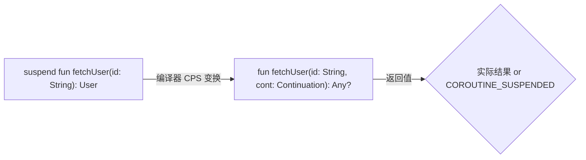

一个包含多个挂起点的函数会被编译为**状态机**：

```kotlin
// 原始代码
suspend fun fetchUser(id: String): User {
    val profile = fetchProfile(id)    // 挂起点 1
    val friends = fetchFriends(id)    // 挂起点 2
    return User(profile, friends)
}
```

编译后的概念性 Java 代码：

```java
Object fetchUser(String id, Continuation<Object> continuation) {
    FetchUserStateMachine sm = (continuation instanceof FetchUserStateMachine)
        ? (FetchUserStateMachine) continuation
        : new FetchUserStateMachine(continuation);

    Object COROUTINE_SUSPENDED = IntrinsicsKt.getCOROUTINE_SUSPENDED();

    while (true) {
        switch (sm.label) {
            case 0: // 函数起始
                sm.id = id;
                sm.label = 1;
                Object profileResult = fetchProfile(id, sm);
                if (profileResult == COROUTINE_SUSPENDED) {
                    return COROUTINE_SUSPENDED; // 挂起，退出函数
                }
                sm.result = profileResult;

            case 1: // fetchProfile 完成后恢复
                Profile profile = (Profile) sm.result;
                sm.profile = profile;
                sm.label = 2;
                Object friendsResult = fetchFriends(sm.id, sm);
                if (friendsResult == COROUTINE_SUSPENDED) {
                    return COROUTINE_SUSPENDED;
                }
                sm.result = friendsResult;

            case 2: // fetchFriends 完成后恢复
                profile = sm.profile;
                List<User> friends = (List<User>) sm.result;
                return new User(profile, friends);
        }
    }
}
```

### 状态机工作流程

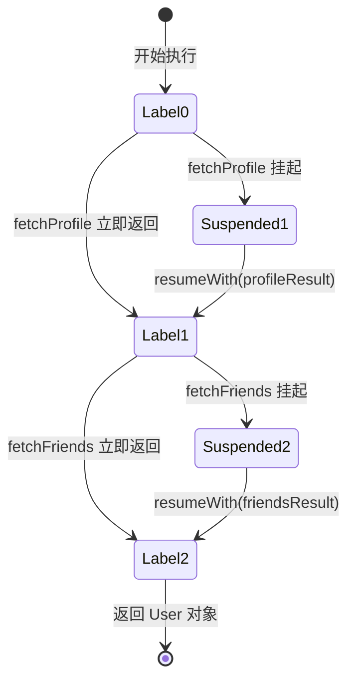

### 深入：编译器生成的状态机类

编译器为每个 `suspend` 函数生成一个继承 `ContinuationImpl` 的内部类，它同时充当**状态机**和**回调**：

```java
// 编译器为 fetchUser 生成的状态机类（概念性反编译）
final class FetchUserStateMachine extends ContinuationImpl {
    int label;          // 当前状态标签，决定恢复到哪个挂起点
    Object result;      // 上一次挂起调用的返回结果
    Object L$0;         // 保存局部变量 slot 0（如 id）
    Object L$1;         // 保存局部变量 slot 1（如 profile）

    FetchUserStateMachine(Continuation<Object> completion) {
        super(completion);  // completion 是调用者的 Continuation
    }

    @Override
    protected Object invokeSuspend(Object result) {
        this.result = result;
        this.label |= Integer.MIN_VALUE;  // 标记为已恢复（防止重复恢复）
        return fetchUser(null, this);     // 重新进入 fetchUser 状态机
    }
}
```

关键设计：
- `label` 字段：每个挂起点对应一个 case，编译器在挂起前将 `label` 设为下一个 case 的值
- `L$0`、`L$1` 等字段：保存跨挂起点存活的局部变量（编译器分析活跃变量后生成）
- `invokeSuspend`：被 `resumeWith` 调用，将结果存入 `result` 后重新进入状态机函数
- `completion`：父级 Continuation，当整个函数执行完毕时通过它返回最终结果

### 完整的挂起-恢复流程

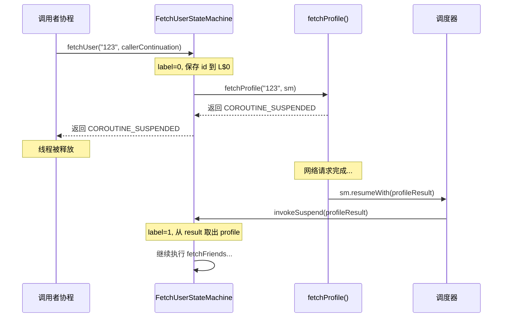

### 挂起与恢复的本质

- **挂起**：函数返回 `COROUTINE_SUSPENDED` 标记值，状态保存在堆上的 Continuation 对象中，线程被释放
- **恢复**：外部系统调用 `resumeWith()` → `invokeSuspend()` → 重新进入状态机函数 → 根据 `label` 跳转到正确的 `case` 继续执行
- **零额外线程**：整个过程没有创建新线程，只是在回调中重新进入同一个函数

### 核心原理：所有挂起函数最终都通过 resumeWith 恢复

这是理解整个协程体系的第一性原理。无论是 `delay`、`withContext`、`channel.send`，还是 Retrofit 的网络请求，所有挂起函数的底层都遵循同一个模式：

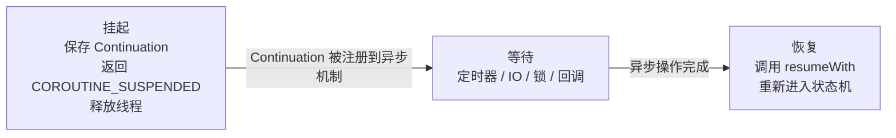

几乎所有挂起函数的内部骨架都是这样的：

```kotlin
suspend fun <T> someOperation(): T {
    return suspendCancellableCoroutine { cont: CancellableContinuation<T> ->
        // 1. 把 Continuation 注册到某个异步机制上
        someAsyncApi.doWork(callback = { result ->
            // 2. 异步操作完成时，调用 resume 恢复协程
            cont.resume(result)  // 内部最终就是 resumeWith(Result.success(result))
        })
        // 3. lambda 结束后，协程挂起（返回 COROUTINE_SUSPENDED）
        //    线程被释放，可以去执行其他协程
    }
}
```

`suspendCancellableCoroutine` 是连接协程世界和回调世界的桥梁。它把当前协程的 `Continuation` 暴露出来，让任何异步机制都能在完成时恢复协程。

#### 常见挂起函数是谁在调用 resumeWith

| 挂起函数 | 谁调用 resumeWith | 触发时机 |
|---------|------------------|---------|
| `delay(1000)` | EventLoop / Handler | 定时器到期 |
| `withContext(Dispatchers.IO)` | IO 线程池 | block 执行完毕 |
| `channel.send()` | 接收方协程 | 有接收者消费了元素 |
| `channel.receive()` | 发送方协程 | 有发送者投递了元素 |
| `job.join()` | 目标 Job | Job 进入完成状态 |
| `deferred.await()` | async 协程 | async 块产生结果 |
| `Mutex.lock()` | 持锁协程 | `unlock()` 释放锁 |
| `Semaphore.acquire()` | 其他协程 | `release()` 释放许可 |
| Retrofit `suspend fun` | OkHttp 回调线程 | HTTP 响应返回 |
| Room `suspend fun` | IO 线程 | 数据库查询完成 |

#### 以 Retrofit 为例：真实世界的 resumeWith

```kotlin
// Retrofit 内部对 suspend 函数的处理（简化）
suspend fun getUser(): User {
    return suspendCancellableCoroutine { cont ->
        val call = okHttpClient.newCall(request)

        // 协程取消时，也取消 HTTP 请求
        cont.invokeOnCancellation { call.cancel() }

        call.enqueue(object : Callback {
            override fun onResponse(call: Call, response: Response) {
                val user = parseResponse(response)
                cont.resume(user)  // HTTP 响应到达，恢复协程
            }

            override fun onFailure(call: Call, e: IOException) {
                cont.resumeWithException(e)  // 请求失败，以异常恢复
            }
        })
    }
}
```

一句话总结：

> **挂起 = 保存 Continuation 并退出函数；恢复 = 调用 `resumeWith` 重新进入状态机。**
> `suspend` 关键字只是编译器的标记，真正的机制全在 Continuation 的传递和 `resumeWith` 的调用上。

---

## 三、协程 vs 线程

协程和线程都用于并发执行，但在管理方式、资源消耗和调度模型上有本质区别。

### 对比总览

| 维度 | 线程 (Thread) | 协程 (Coroutine) |
|------|--------------|-----------------|
| 管理层级 | OS 内核管理 | 用户空间（Kotlin 运行时） |
| 创建成本 | 系统调用 + ~1MB 栈内存 | 堆上小对象（几百字节） |
| 并发数量 | 数百~数千 | 数十万~百万 |
| 调度方式 | 抢占式（OS 调度器） | 协作式（在挂起点让出） |
| 上下文切换 | 昂贵（内核态切换） | 廉价（函数调用级别） |
| 阻塞行为 | 阻塞整个线程 | 仅挂起协程，线程被释放 |

### 直观对比

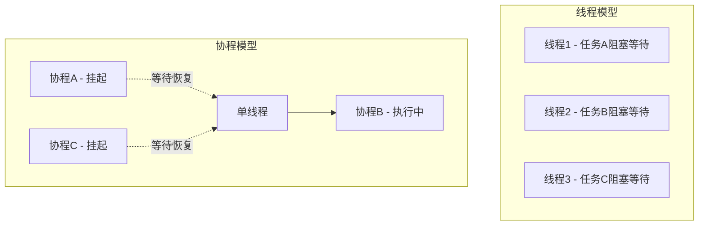

### 代码对比：10万个并发任务

```kotlin
// 线程方式 —— 很可能 OOM
fun main() {
    val threads = List(100_000) {
        Thread {
            Thread.sleep(1000L)
            print(".")
        }.apply { start() }
    }
    threads.forEach { it.join() }
}

// 协程方式 —— 轻松完成
fun main() = runBlocking {
    val jobs = List(100_000) {
        launch {
            delay(1000L)
            print(".")
        }
    }
    jobs.forEach { it.join() }
}
```

### 何时选择线程 vs 协程

- **协程**：I/O 密集型任务（网络请求、数据库查询）、UI 更新、高并发场景
- **线程**：CPU 密集型计算（配合 `Dispatchers.Default`）、需要与 Java 阻塞 API 交互时

---

## 四、协程构建器

协程构建器是创建和启动协程的入口函数。Kotlin 提供了多种构建器，适用于不同场景。

### 构建器总览

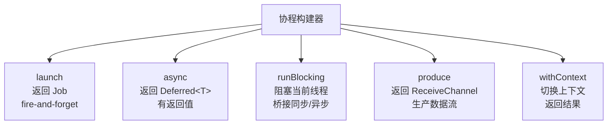

所有构建器内部都遵循相同的三步模式，但每一步的具体行为不同：

| 构建器 | ① 上下文来源 | ② 创建的协程对象 | ③ 启动方式 |
|--------|------------|----------------|-----------|
| `launch` | 继承父 Scope + 合并参数 + 新子 Job | `StandaloneCoroutine` | 调度到目标线程 |
| `async` | 继承父 Scope + 合并参数 + 新子 Job | `DeferredCoroutine<T>` | 调度到目标线程 |
| `runBlocking` | 从零创建 + EventLoop | `BlockingCoroutine` | 当前线程事件循环 |
| `withContext` | 合并当前上下文（不创建新 Job） | `ScopeCoroutine` / `DispatchedCoroutine` | 取决于是否需要切换线程 |
| `produce` | 继承父 Scope + 合并参数 + 新子 Job | `ProducerCoroutine` | 调度到目标线程 |

### 1. launch —— 启动即忘

`launch` 启动一个不返回结果的协程，返回 `Job` 用于管理生命周期。

```kotlin
fun main() = runBlocking {
    val job: Job = launch {
        delay(1000L)
        println("Task completed")
    }
    println("Task launched")
    job.join() // 等待完成
}
```

#### launch 内部做了什么

当你调用 `launch { ... }` 时，内部经历三个阶段：


**阶段一：构建上下文** —— 继承 + 合并

```kotlin
val newContext = newCoroutineContext(context)
// 做了什么：
// 父 Scope 的 context + 你传入的 context + 新创建的子 Job + (调试模式下的 CoroutineId)
// 例如：父 Scope 有 Dispatchers.Main + SupervisorJob
//       你传入 CoroutineName("fetch")
//       最终 = Dispatchers.Main + 新子Job(parent=SupervisorJob) + CoroutineName("fetch")
```

**阶段二：创建协程对象** —— 根据启动模式选择实现类

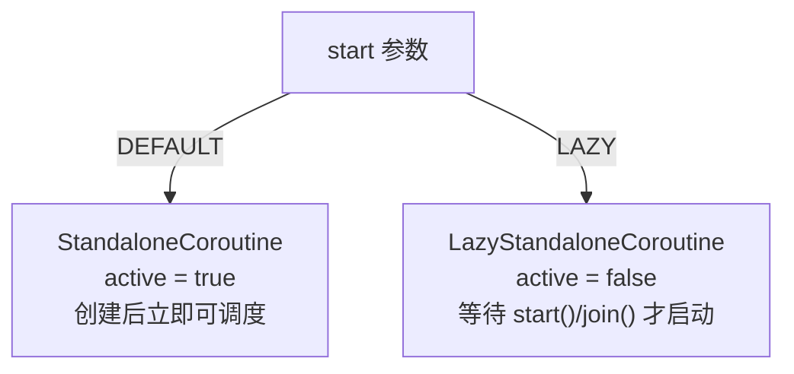

最后一步 `resumeCancellableWith` 会把协程提交给调度器。如果是 `Dispatchers.Main`，就会 post 到主线程消息队列；如果是 `Dispatchers.Default`，就会提交到线程池。

内部实现要点：
- 创建 `StandaloneCoroutine`（继承 `AbstractCoroutine<Unit>`）
- 通过 `newCoroutineContext()` 继承父作用域的上下文
- 默认 `CoroutineStart.DEFAULT` 立即调度执行

#### launch 源码解析

```kotlin
// kotlinx.coroutines 源码
public fun CoroutineScope.launch(
    context: CoroutineContext = EmptyCoroutineContext,
    start: CoroutineStart = CoroutineStart.DEFAULT,
    block: suspend CoroutineScope.() -> Unit
): Job {
    // 1. 上下文创建：继承父 Scope 的上下文 + 合并传入的 context
    val newContext = newCoroutineContext(context)

    // 2. 协程实例化：根据启动模式选择不同的实现类
    val coroutine = if (start.isLazy)
        LazyStandaloneCoroutine(newContext, block)
    else
        StandaloneCoroutine(newContext, active = true)

    // 3. 启动协程
    coroutine.start(start, coroutine, block)

    // 4. 返回 Job
    return coroutine
}
```

`StandaloneCoroutine` 的类层次：

```kotlin
private open class StandaloneCoroutine(
    parentContext: CoroutineContext,
    active: Boolean
) : AbstractCoroutine<Unit>(parentContext, initParentJob = true, active = active) {

    // 关键：覆盖异常处理，将未捕获异常传播给父 Job
    override fun handleJobException(exception: Throwable): Boolean {
        handleCoroutineException(context, exception)
        return true
    }
}
```

`LazyStandaloneCoroutine` 的延迟启动机制：

```kotlin
private class LazyStandaloneCoroutine(
    parentContext: CoroutineContext,
    block: suspend CoroutineScope.() -> Unit
) : StandaloneCoroutine(parentContext, active = false) {
    // 在构造时就创建 Continuation，但不调度执行
    private val continuation = block.createCoroutineUnintercepted(this, this)

    // 当调用 start() 或 join() 时触发
    override fun onStart() {
        continuation.startCoroutineCancellable(this)
    }
}
```

### 2. async —— 带返回值的并发

`async` 启动协程并返回 `Deferred<T>`，通过 `await()` 获取结果。

```kotlin
fun main() = runBlocking {
    val deferred1: Deferred<Int> = async {
        delay(1000L)
        42
    }
    val deferred2: Deferred<Int> = async {
        delay(1000L)
        58
    }
    // 两个任务并行执行，总耗时约 1 秒
    println("Sum = ${deferred1.await() + deferred2.await()}")
}
```

#### async 源码解析

```kotlin
public fun <T> CoroutineScope.async(
    context: CoroutineContext = EmptyCoroutineContext,
    start: CoroutineStart = CoroutineStart.DEFAULT,
    block: suspend CoroutineScope.() -> T
): Deferred<T> {
    val newContext = newCoroutineContext(context)

    // 关键区别：创建 DeferredCoroutine<T> 而非 StandaloneCoroutine
    val coroutine = if (start.isLazy)
        LazyDeferredCoroutine(newContext, block)
    else
        DeferredCoroutine<T>(newContext, active = true)

    coroutine.start(start, coroutine, block)
    return coroutine  // 返回的是 Deferred<T>
}
```

`DeferredCoroutine` 的核心——它同时是 Job 和 Future：

```kotlin
private open class DeferredCoroutine<T>(
    parentContext: CoroutineContext,
    active: Boolean
) : AbstractCoroutine<T>(parentContext, true, active = active), Deferred<T> {
    // 泛型 T 表示协程完成时产生的值类型
    // 对比 StandaloneCoroutine 继承的是 AbstractCoroutine<Unit>

    override fun getCompleted(): T = getCompletedInternal() as T
    override suspend fun await(): T = awaitInternal() as T
    override val onAwait: SelectClause1<T> get() = onAwaitInternal as SelectClause1<T>
}
```

`await()` 的内部机制：`awaitInternal()` 是一个挂起函数，它检查 `DeferredCoroutine` 的状态——如果已完成则直接返回结果，否则将调用者的 Continuation 注册为完成回调并挂起。

#### async vs launch：同一套流程，不同的协程对象

`async` 的三个阶段和 `launch` 完全一样（构建上下文 → 创建对象 → 启动调度），唯一的区别在于第二步创建的对象不同：

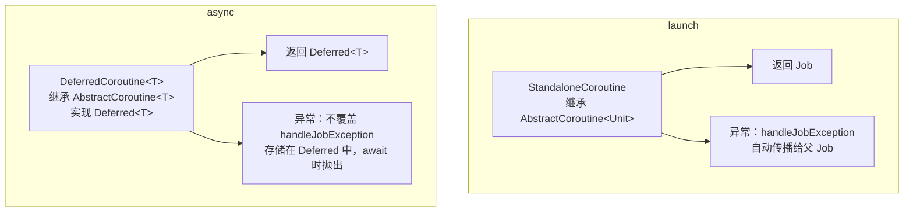

两个关键差异：

**差异一：泛型参数**
- `StandaloneCoroutine` 继承 `AbstractCoroutine<Unit>` —— 不关心返回值
- `DeferredCoroutine<T>` 继承 `AbstractCoroutine<T>` —— 协程块的最后一个表达式就是结果值 `T`

**差异二：异常处理**
- `StandaloneCoroutine` 覆盖了 `handleJobException` → 异常自动向上传播
- `DeferredCoroutine` 没有覆盖 → 异常被存储在内部状态中，调用 `await()` 时才抛出

#### await() 的内部机制

`await()` 本质上也是前面讲的 `resumeWith` 模式的一个实例：

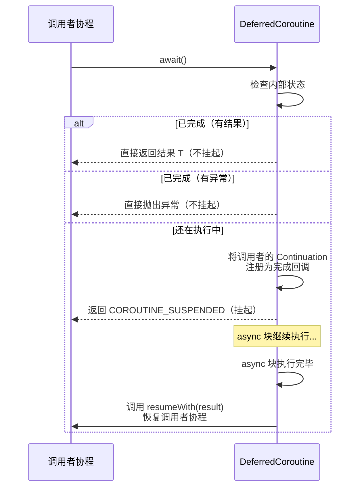

`async` 与 `launch` 的其他区别：
- `DeferredCoroutine` 不覆盖 `handleJobException`，异常不会自动传播，而是存储在 Deferred 中
- 支持 `CoroutineStart.LAZY` 延迟启动

```kotlin
val lazy = async(start = CoroutineStart.LAZY) {
    heavyComputation()
}
// 直到调用 start() 或 await() 才开始执行
lazy.start()
```

### 3. runBlocking —— 阻塞桥接

`runBlocking` 阻塞当前线程直到内部所有协程完成，用于 `main` 函数和单元测试。

```kotlin
fun main() = runBlocking {
    println("Starting")
    launch {
        delay(1000L)
        println("Inside coroutine")
    }
    println("Ending")
}
// Starting → Ending → Inside coroutine
```

#### runBlocking 与其他构建器的本质区别

`launch` 和 `async` 是**挂起式**的，它们在协程世界内部工作，不阻塞线程。`runBlocking` 则是**阻塞式**的，它是普通函数世界通往协程世界的桥梁。

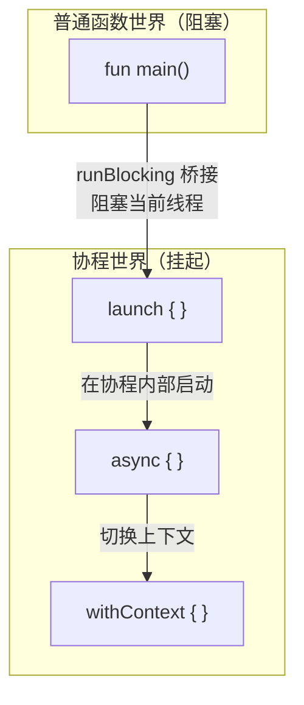

#### runBlocking 内部做了什么

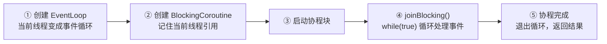

内部机制：
- 创建 `BlockingCoroutine`，内部 `joinBlocking()` 使用 `while(true)` 循环 + `parkNanos` 阻塞当前线程
- 使用线程本地的 `EventLoop` 处理事件

#### runBlocking 源码解析

```kotlin
public actual fun <T> runBlocking(
    context: CoroutineContext,
    block: suspend CoroutineScope.() -> T
): T {
    val currentThread = Thread.currentThread()
    val contextInterceptor = context[ContinuationInterceptor]
    val eventLoop: EventLoop?
    val newContext: CoroutineContext

    if (contextInterceptor == null) {
        // 没有指定调度器时，创建或复用线程本地的 EventLoop
        eventLoop = ThreadLocalEventLoop.eventLoop
        newContext = GlobalScope.newCoroutineContext(context + eventLoop)
    } else {
        eventLoop = (contextInterceptor as? EventLoop)
            ?.takeIf { it.shouldBeProcessedFromContext() }
            ?: ThreadLocalEventLoop.currentOrNull()
        newContext = GlobalScope.newCoroutineContext(context)
    }

    // 创建 BlockingCoroutine，记住当前线程
    val coroutine = BlockingCoroutine<T>(newContext, currentThread, eventLoop)
    coroutine.start(CoroutineStart.DEFAULT, coroutine, block)
    return coroutine.joinBlocking()  // 阻塞在这里！
}
```

`BlockingCoroutine.joinBlocking()` —— 阻塞的核心：

```kotlin
private class BlockingCoroutine<T>(
    parentContext: CoroutineContext,
    private val blockedThread: Thread,
    private val eventLoop: EventLoop?
) : AbstractCoroutine<T>(parentContext, true, true) {

    override fun afterCompletion(state: Any?) {
        // 协程完成时唤醒被阻塞的线程
        if (Thread.currentThread() != blockedThread)
            unpark(blockedThread)
    }

    fun joinBlocking(): T {
        registerTimeLoopThread()
        try {
            eventLoop?.incrementUseCount()
            try {
                while (true) {  // 核心：无限循环阻塞当前线程
                    if (Thread.interrupted())
                        throw InterruptedException().also { cancelCoroutine(it) }

                    // 处理 EventLoop 中的下一个事件（如 delay 到期的协程）
                    val parkNanos = eventLoop?.processNextEvent() ?: Long.MAX_VALUE

                    if (isCompleted) break  // 协程完成，退出循环

                    parkNanos(this, parkNanos)  // 阻塞线程，等待事件或完成
                }
            } finally {
                eventLoop?.decrementUseCount()
            }
        } finally {
            unregisterTimeLoopThread()
        }
        // 返回结果或抛出异常
        val state = this.state.unboxState()
        (state as? CompletedExceptionally)?.let { throw it.cause }
        return state as T
    }
}
```

`runBlocking` 的阻塞本质：`joinBlocking()` 中的 `while(true)` + `parkNanos` 会持续阻塞调用线程，直到协程完成。`Thread.currentThread()` 决定了被阻塞的线程——这就是为什么在 Android 主线程调用会导致 ANR。

> **注意**：在 Android 主线程使用 `runBlocking` 会导致 ANR。应使用 `lifecycleScope.launch` 或 `viewModelScope.launch`。单元测试中推荐使用 `runTest`（会跳过 `delay`）。

### 4. produce —— Channel 生产者

`produce` 启动一个协程，通过 Channel 发送数据流。

```kotlin
fun main() = runBlocking {
    val channel: ReceiveChannel<Int> = produce {
        for (i in 1..5) send(i)
    }
    for (value in channel) {
        println("Received: $value")
    }
}
```

### 5. withContext —— 上下文切换

`withContext` 在指定上下文中执行挂起代码块并返回结果，常用于切换调度器。

```kotlin
suspend fun fetchFromNetwork(): String = withContext(Dispatchers.IO) {
    // 在 IO 线程池执行
    api.getData()
}

suspend fun updateUI(data: String) = withContext(Dispatchers.Main) {
    // 切回主线程更新 UI
    textView.text = data
}
```

#### withContext 与 launch/async 的根本区别

`launch` 和 `async` 是**启动新协程**，与调用者并发执行。`withContext` 不启动新协程，而是**在当前协程内切换执行环境**，是顺序的：

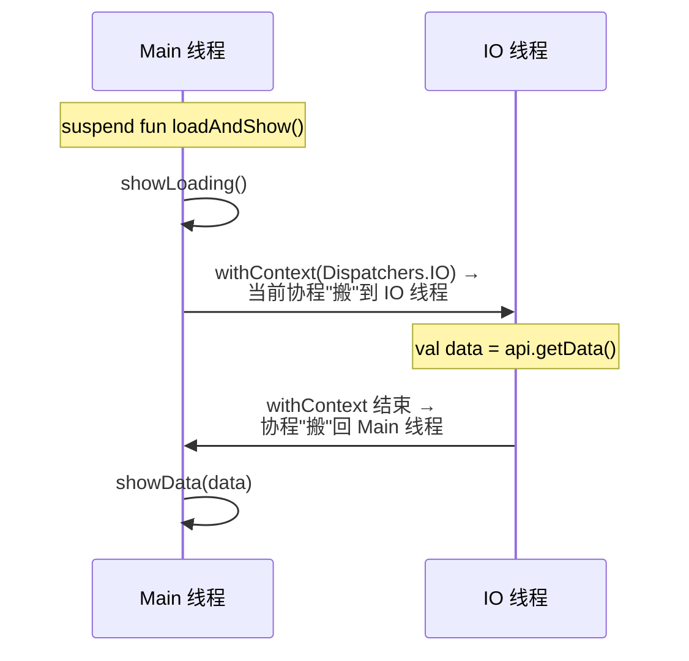

注意：协程始终是同一个，只是执行它的线程变了。这和 `launch` 启动一个全新的子协程完全不同。

#### withContext 的三条内部路径

`withContext` 会根据新旧上下文的差异，选择开销最小的执行方式：

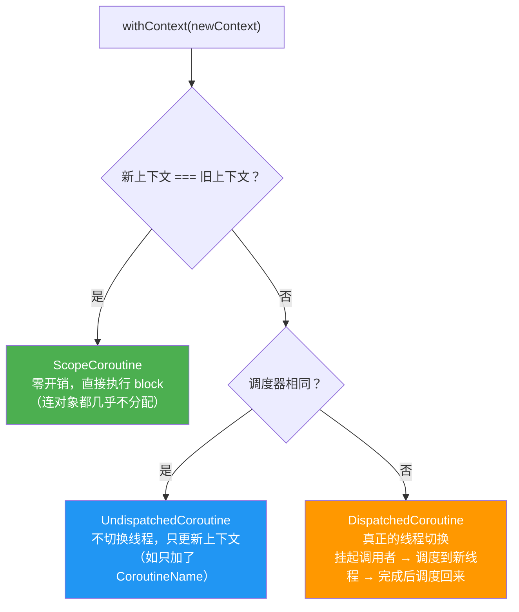

以最常见的第三条路径为例（`withContext(Dispatchers.IO)`）：

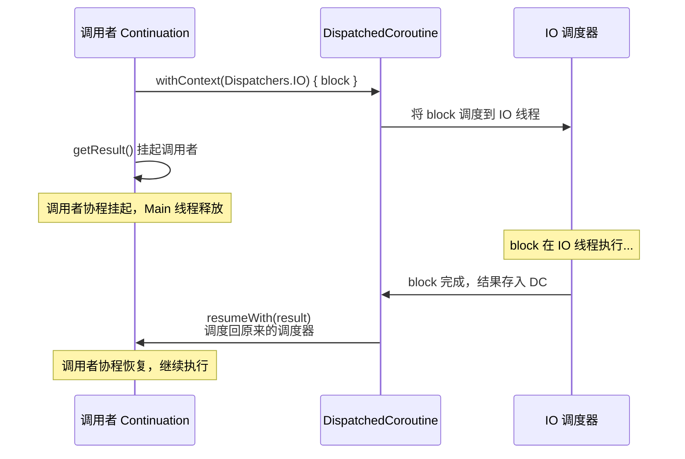

内部机制：
- 如果新上下文与当前相同，直接执行（`ScopeCoroutine`）
- 如果需要切换调度器，创建 `DispatchedCoroutine` 并调度到目标线程

#### withContext 源码解析

```kotlin
public suspend fun <T> withContext(
    context: CoroutineContext,
    block: suspend CoroutineScope.() -> T
): T {
    // 1. 合并当前上下文与新上下文
    val oldContext = uCont.context  // uCont = 调用者的 Continuation
    val newContext = oldContext.newCoroutineContext(context)

    // 2. 快速路径：上下文没有变化
    if (newContext === oldContext) {
        val coroutine = ScopeCoroutine(newContext, uCont)
        return coroutine.startUndispatchedOrReturn(coroutine, block)
    }

    // 3. 检查调度器是否相同
    if (newContext[ContinuationInterceptor] == oldContext[ContinuationInterceptor]) {
        // 调度器相同，无需切换线程
        val coroutine = UndispatchedCoroutine(newContext, uCont)
        return coroutine.startUndispatchedOrReturn(coroutine, block)
    }

    // 4. 需要切换调度器 —— 创建 DispatchedCoroutine
    val coroutine = DispatchedCoroutine(newContext, uCont)
    block.startCoroutineCancellable(coroutine, coroutine)
    coroutine.getResult()  // 挂起调用者，等待 block 在新调度器上完成
}
```

三种路径的区别：
- `ScopeCoroutine`：上下文完全相同，零开销直接执行
- `UndispatchedCoroutine`：上下文不同但调度器相同（如只加了 `CoroutineName`），不需要线程切换
- `DispatchedCoroutine`：调度器不同，需要真正的线程切换，调用者被挂起

---

## 五、协程上下文 CoroutineContext

`CoroutineContext` 是协程的执行环境，本质上是一个**不可变的、以 `Key` 为索引的元素集合**（类似 Map）。

理解上下文是理解协程的关键。前面讲的构建器、调度器、Job、异常处理器，都是上下文中的元素；上下文把这些概念串联成一个整体。

### 上下文与构建器的关系

每个构建器都会创建新的上下文，但方式不同：

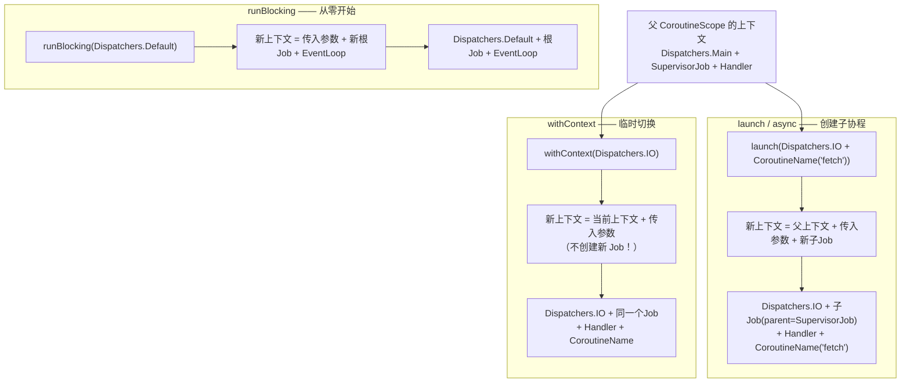

关键区别：
- `launch`/`async`：**继承**父上下文 + **创建新子 Job**（建立父子关系，这是结构化并发的基础）
- `withContext`：**合并**当前上下文 + **不创建新 Job**（同一个协程，只是换了执行环境）
- `runBlocking`：**不继承**任何父上下文（它是桥梁，从零开始创建根上下文）

### newCoroutineContext —— 构建器创建上下文的核心函数

所有构建器内部都调用 `newCoroutineContext()` 来组装最终上下文：

```kotlin
// 简化后的逻辑
public actual fun CoroutineScope.newCoroutineContext(context: CoroutineContext): CoroutineContext {
    // 父 Scope 的上下文 + 你传入的上下文（右侧覆盖左侧同 Key 元素）
    val combined = coroutineContext + context

    // 调试模式下自动添加 CoroutineId
    val debug = if (DEBUG) combined + CoroutineId(COROUTINE_ID.incrementAndGet()) else combined

    // 如果没有指定调度器，默认使用 Dispatchers.Default
    return if (combined !== Dispatchers.Default && combined[ContinuationInterceptor] == null)
        debug + Dispatchers.Default
    else debug
}
```

然后构建器会在这个上下文基础上创建新的子 Job 并附加到父 Job 上（`initParentJob`），最终形成完整的协程上下文。

### 核心结构

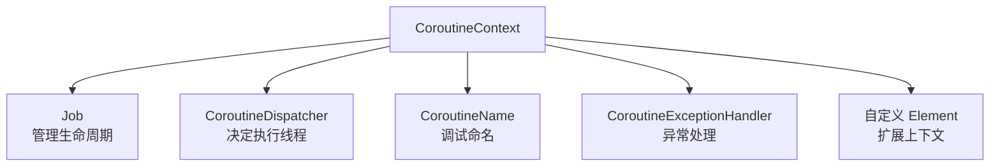

每个元素都有唯一的 `Key`，上下文通过 Key 索引元素，这也是同类型元素会被覆盖而不是叠加的原因。

### 上下文的组合与继承

上下文通过 `+` 运算符组合，右侧元素覆盖左侧同 Key 元素：

```kotlin
val context = Dispatchers.IO + CoroutineName("myCoroutine") + Job()

// 子协程继承父上下文，但可以覆盖特定元素
launch(Dispatchers.IO + CoroutineName("child")) {
    println(coroutineContext[CoroutineName]) // CoroutineName(child)
}
```

### 上下文元素的访问

```kotlin
fun main() = runBlocking {
    launch(Dispatchers.Default + CoroutineName("test")) {
        // 通过 Key 访问
        println(coroutineContext[Job])             // 当前 Job
        println(coroutineContext[CoroutineName])   // CoroutineName(test)

        // 移除元素
        val withoutName = coroutineContext.minusKey(CoroutineName)
    }
}
```

### 自定义上下文元素

```kotlin
data class UserId(val id: String) : AbstractCoroutineContextElement(UserId) {
    companion object Key : CoroutineContext.Key<UserId>
}

launch(UserId("user-123")) {
    val userId = coroutineContext[UserId]?.id
    println("Current user: $userId") // Current user: user-123
}
```

---

## 六、Job 与结构化并发

`Job` 是协程的可取消工作单元，代表协程的生命周期。每个通过 `launch` 或 `async` 创建的协程都会返回一个 `Job`（或 `Deferred`）。

### Job 的状态机

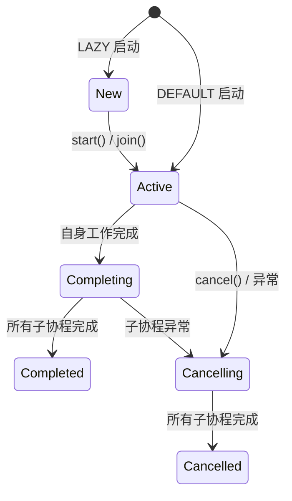

| 状态 | isActive | isCompleted | isCancelled |
|------|----------|-------------|-------------|
| New | false | false | false |
| Active | true | false | false |
| Completing | true | false | false |
| Cancelling | false | false | true |
| Cancelled | false | true | true |
| Completed | false | true | false |

### 深入：JobSupport 内部状态机

`Job` 接口的真正复杂性在其实现类 `JobSupport` 中。它使用**无锁状态机**管理协程生命周期，核心是一个原子字段 `_state`：

```kotlin
public open class JobSupport constructor(active: Boolean) : Job {
    // 单一原子字段，持有不同类型的对象表示不同状态
    private val _state = atomic<Any?>(
        if (active) EMPTY_ACTIVE  // Active 状态
        else EMPTY_NEW            // New 状态（lazy 启动）
    )
}
```

`_state` 字段可以持有的值类型：

| _state 值类型 | 对应状态 | 说明 |
|--------------|---------|------|
| `EMPTY_NEW` | New | 延迟启动，无完成回调 |
| `EMPTY_ACTIVE` | Active | 活跃，无完成回调 |
| `NodeList` | Active/Completing | 活跃，有注册的完成回调列表 |
| `CompletingState` | Completing | 自身完成，等待子协程 |
| `CancelledState` | Cancelled | 最终取消状态 |
| `CompletedExceptionally` | Completed(异常) | 异常完成 |
| 其他任意值 | Completed(成功) | 成功完成，值即结果 |

#### 父子关系的建立：initParentJob

```kotlin
protected fun initParentJob(parent: Job?) {
    // ...
    // 子 Job 将自己附加到父 Job 的子列表中
    val handle = parent.attachChild(this)
    parentHandle = handle  // 保存句柄，完成时用于从父 Job 脱离
    // ...
}
```

`parent.attachChild(this)` 将子 Job 添加到父 Job 的内部子列表，返回 `ChildHandle`。子 Job 完成时调用 `handle.dispose()` 从父 Job 脱离。

#### 状态转换的原子操作

所有状态转换都通过 CAS（Compare-And-Set）操作完成，保证线程安全且无锁：

```kotlin
// 取消操作的简化逻辑
private fun cancelImpl(cause: Any?): Boolean {
    // ... 通过 CAS 将 _state 从 Active 转为 Cancelling
    // 然后遍历 children 列表，逐个取消子 Job
    notifyHandlers(state, cause)
    return true
}

// 完成操作的简化逻辑
private fun tryMakeCompleting(state: Any?, proposedUpdate: Any?): Any? {
    // 检查是否还有活跃的子 Job
    // 如果有 → 进入 Completing 状态，等待子 Job
    // 如果没有 → 直接进入 Completed/Cancelled 最终状态
}
```

#### Completing 状态的关键作用

`Completing` 是结构化并发的核心状态。当协程自身的代码执行完毕但仍有子协程在运行时：

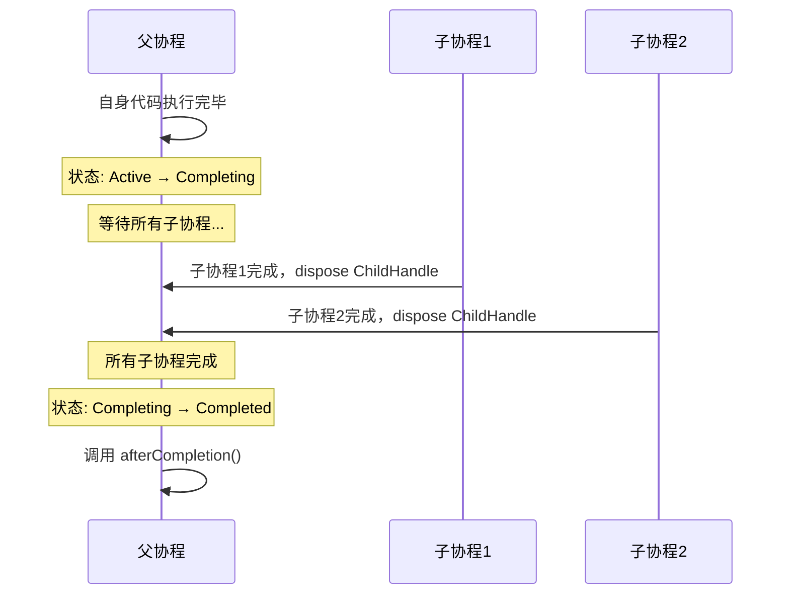

### 基本用法

```kotlin
fun main() = runBlocking {
    val job = launch {
        repeat(5) { i ->
            println("Working on task $i...")
            delay(500L)
        }
    }

    delay(1500L)
    println("Canceling job...")
    job.cancel()  // 取消协程
    job.join()    // 等待取消完成
    // 可简写为 job.cancelAndJoin()
    println("Job canceled.")
}
// Working on task 0...
// Working on task 1...
// Working on task 2...
// Canceling job...
// Job canceled.
```

### 结构化并发：父子关系

```mermaid
flowchart TD
    Parent[父 Job]
    Parent --> Child1[子 Job 1]
    Parent --> Child2[子 Job 2]
    Parent --> Child3[子 Job 3]

    style Parent fill:#4CAF50,color:white
    style Child1 fill:#2196F3,color:white
    style Child2 fill:#2196F3,color:white
    style Child3 fill:#2196F3,color:white
```

结构化并发的核心规则：

1. **向下取消**：取消父 Job 会递归取消所有子 Job
2. **向上等待**：父 Job 进入 Completing 状态后，必须等待所有子 Job 完成才能进入 Completed
3. **向上传播异常**：子 Job 的未处理异常会传播到父 Job（`SupervisorJob` 除外）

```kotlin
fun main() = runBlocking {
    val parentJob = launch {
        val child1 = launch {
            delay(1000L)
            println("Child 1 done")
        }
        val child2 = launch {
            delay(2000L)
            println("Child 2 done")
        }
        println("Parent waiting for children...")
    }
    parentJob.join() // 等待父 Job 及其所有子 Job 完成
    println("All done")
}
```

### SupervisorJob —— 独立失败

普通 `Job` 中一个子协程失败会取消所有兄弟协程。`SupervisorJob` 让子协程独立失败：

```kotlin
fun main() = runBlocking {
    val supervisor = SupervisorJob()

    val scope = CoroutineScope(coroutineContext + supervisor)

    val child1 = scope.launch {
        println("Child 1 started")
        throw RuntimeException("Child 1 failed")
    }

    val child2 = scope.launch {
        delay(1000L)
        println("Child 2 completed") // 不受 child1 影响，正常完成
    }

    delay(2000L)
}
```

---

## 七、协程作用域 CoroutineScope

`CoroutineScope` 是一个接口，定义了协程的生命周期边界。它是结构化并发的载体——所有协程构建器（`launch`、`async`）都是 `CoroutineScope` 的扩展函数。

### CoroutineScope 接口

```kotlin
public interface CoroutineScope {
    public val coroutineContext: CoroutineContext
}
```

### 常用作用域

```mermaid
flowchart TD
    Scope[CoroutineScope]
    Scope --> GS["GlobalScope<br/>⚠️ 全局作用域<br/>无生命周期管理"]
    Scope --> RS["runBlocking 作用域<br/>阻塞当前线程"]
    Scope --> CS["coroutineScope{}<br/>挂起函数中创建"]
    Scope --> SS["supervisorScope{}<br/>子协程独立失败"]

    subgraph Android
        LS["lifecycleScope<br/>绑定 Activity/Fragment"]
        VS["viewModelScope<br/>绑定 ViewModel"]
    end
    Scope --> LS
    Scope --> VS
```

### Android 中的生命周期作用域

```kotlin
// Activity 中使用 lifecycleScope
class MainActivity : AppCompatActivity() {
    override fun onCreate(savedInstanceState: Bundle?) {
        super.onCreate(savedInstanceState)

        lifecycleScope.launch {
            val data = fetchData()
            println("Data: $data")
        }
        // Activity 销毁时自动取消
    }
}

// ViewModel 中使用 viewModelScope
class MyViewModel : ViewModel() {
    fun loadData() {
        viewModelScope.launch {
            val result = repository.fetchData()
            _uiState.value = result
        }
        // ViewModel 清除时自动取消
    }
}
```

`lifecycleScope` 内部实现：`SupervisorJob() + Dispatchers.Main.immediate`

### 自定义作用域

```kotlin
class MyRepository {
    private val job = SupervisorJob()
    private val scope = CoroutineScope(Dispatchers.IO + job)

    fun fetchData() {
        scope.launch {
            val data = fetchDataFromNetwork()
            println("Data fetched: $data")
        }
    }

    fun clear() {
        job.cancel() // 取消所有协程
    }
}
```

### coroutineScope vs supervisorScope

```kotlin
// coroutineScope: 任一子协程失败 → 取消所有兄弟 → 向上抛异常
suspend fun loadBoth() = coroutineScope {
    val user = async { fetchUser() }
    val posts = async { fetchPosts() } // 如果这里失败，user 也会被取消
    Pair(user.await(), posts.await())
}

// supervisorScope: 子协程独立失败，不影响兄弟
suspend fun loadIndependent() = supervisorScope {
    val user = async { fetchUser() }
    val posts = async { fetchPosts() } // 失败不影响 user
    // 但需要自行处理每个 async 的异常
}
```

### 为什么要慎用 GlobalScope

`GlobalScope` 的 `coroutineContext` 是 `EmptyCoroutineContext`：
- **没有 Job**：协程不受任何生命周期管理，无法统一取消
- **没有生命周期**：协程存活到应用进程结束或自身完成
- **内存泄漏风险**：Activity 销毁后协程仍在运行，持有对已销毁组件的引用

---

## 八、调度器 Dispatchers

调度器决定协程在哪个线程（或线程池）上执行。所有调度器都继承自 `CoroutineDispatcher`，它实现了 `ContinuationInterceptor` 接口。

### 调度器类型

| 调度器 | 线程 | 适用场景 | 注意事项 |
|--------|------|---------|---------|
| `Dispatchers.Main` | 主/UI 线程 | UI 更新、用户交互 | 仅用于 UI 相关任务 |
| `Dispatchers.Main.immediate` | 主线程（立即执行） | 即时 UI 更新 | 避免不必要的重新调度 |
| `Dispatchers.IO` | 共享后台线程池 | 网络请求、文件读写、数据库 | 默认最多 64 + CPU核心数 个线程 |
| `Dispatchers.Default` | CPU 线程池 | 计算密集型任务 | 线程数 = CPU 核心数（最少 2） |
| `Dispatchers.Unconfined` | 无固定线程 | 测试、轻量同步 | 挂起后可能切换线程，慎用 |

### 调度器的内部机制

```mermaid
sequenceDiagram
    participant C as 协程
    participant CI as ContinuationInterceptor
    participant DC as DispatchedContinuation
    participant D as Dispatcher
    participant TP as 线程池

    C->>CI: interceptContinuation(cont)
    CI->>DC: 包装为 DispatchedContinuation
    Note over DC: 持有 Dispatcher 引用
    DC->>D: dispatch(context, runnable)
    D->>TP: 提交到线程池执行
    TP->>C: 在目标线程恢复协程
```

核心流程：
1. `CoroutineDispatcher` 实现 `ContinuationInterceptor`
2. 将原始 `Continuation` 包装为 `DispatchedContinuation`
3. 恢复时调用 `dispatch()` 将执行逻辑提交到目标线程

#### CoroutineDispatcher 源码解析

```kotlin
// CoroutineDispatcher 的类签名揭示了其本质
public abstract class CoroutineDispatcher :
    AbstractCoroutineContextElement(ContinuationInterceptor),
    ContinuationInterceptor {

    // 拦截 Continuation，包装为 DispatchedContinuation
    public final override fun <T> interceptContinuation(
        continuation: Continuation<T>
    ): Continuation<T> =
        DispatchedContinuation(this, continuation)

    // 子类必须实现：将 Runnable 调度到目标线程执行
    public abstract fun dispatch(context: CoroutineContext, block: Runnable)
}
```

`DispatchedContinuation` —— 调度的核心包装器：

```kotlin
internal class DispatchedContinuation<T>(
    val dispatcher: CoroutineDispatcher,
    val continuation: Continuation<T>  // 原始 Continuation
) : Continuation<T> {

    override fun resumeWith(result: Result<T>) {
        // 不直接执行恢复逻辑，而是通过 dispatcher 调度
        val context = continuation.context
        if (dispatcher.isDispatchNeeded(context)) {
            // 将恢复逻辑包装为 Runnable，提交给调度器
            dispatcher.dispatch(context, this)  // this 实现了 Runnable
        } else {
            // 不需要调度（如 Dispatchers.Unconfined），直接执行
            resumeUndispatchedWith(result)
        }
    }
}
```

各调度器的 `dispatch` 实现差异：

```kotlin
// Dispatchers.Main (Android)
// dispatch → Handler(Looper.getMainLooper()).post(runnable)
// 将 Runnable 投递到主线程的消息队列

// Dispatchers.IO / Dispatchers.Default
// dispatch → ExecutorService.execute(runnable)
// 提交到内部线程池

// Dispatchers.Unconfined
// isDispatchNeeded() 返回 false，不经过 dispatch
// 直接在当前线程恢复（但挂起后可能在不同线程恢复）
```

`dispatch` 的重要契约：**不能立即执行 block**，必须调度到"稍后"执行。这防止了在 `yield()` 等紧密循环中出现 `StackOverflowError`。

### limitedParallelism —— 自定义并行度

```kotlin
// 从 IO 调度器创建一个限制为 4 线程的子调度器
val dbDispatcher = Dispatchers.IO.limitedParallelism(4)

suspend fun queryDatabase() = withContext(dbDispatcher) {
    // 最多 4 个协程同时执行数据库操作
    database.query("SELECT * FROM users")
}
```

---

## 九、Channel 通道

Channel 是协程间通信的管道，类似于 `BlockingQueue`，但使用挂起操作替代阻塞操作。

### Channel 的双面接口

```mermaid
flowchart LR
    Producer[生产者协程] -->|SendChannel.send| Channel["Channel&lt;E&gt;"]
    Channel -->|ReceiveChannel.receive| Consumer[消费者协程]
```

- `SendChannel<in E>`：生产者接口，提供 `send()`、`trySend()`、`close()`
- `ReceiveChannel<out E>`：消费者接口，提供 `receive()`、`tryReceive()`、`cancel()`
- `Channel<E>`：同时继承两者

### Channel 类型

| 类型 | 容量 | 行为 |
|------|------|------|
| `Channel.RENDEZVOUS` (默认) | 0 | 发送方和接收方必须"会合"，send 挂起直到有 receive |
| `Channel.BUFFERED` | 64（默认） | 缓冲区满时 send 挂起 |
| `Channel.UNLIMITED` | 无限 | send 永不挂起（注意内存） |
| `Channel.CONFLATED` | 1 | 只保留最新值，旧值被覆盖 |

### 使用示例

```kotlin
fun main() = runBlocking {
    // Rendezvous Channel —— 无缓冲
    val rendezvous = Channel<Int>()

    launch {
        for (i in 1..5) {
            println("Sending $i")
            rendezvous.send(i) // 挂起直到接收方准备好
        }
        rendezvous.close()
    }

    for (value in rendezvous) {
        println("Received $value")
        delay(500L) // 模拟慢消费
    }
}
```

```kotlin
// Buffered Channel
val buffered = Channel<Int>(capacity = 3)

// Unlimited Channel —— send 永不挂起
val unlimited = Channel<Int>(Channel.UNLIMITED)

// Conflated Channel —— 只保留最新值
val conflated = Channel<Int>(Channel.CONFLATED)
```

### Channel 内部机制

Channel 内部维护三个关键结构：
1. **元素缓冲区**：存放已发送但未被接收的元素
2. **挂起发送者队列**：缓冲区满时，发送者的 Continuation 入队等待
3. **挂起接收者队列**：缓冲区空时，接收者的 Continuation 入队等待

```mermaid
flowchart TD
    Send["send(element)"]
    Send --> HasReceiver{有等待的接收者?}
    HasReceiver -->|是| Direct[直接传递给接收者并恢复]
    HasReceiver -->|否| HasBuffer{缓冲区有空间?}
    HasBuffer -->|是| Buffer[放入缓冲区]
    HasBuffer -->|否| Suspend[挂起发送者]

    Receive["receive()"]
    Receive --> HasElement{缓冲区有元素?}
    HasElement -->|是| Return[取出并返回]
    HasElement -->|否| HasSender{有等待的发送者?}
    HasSender -->|是| Take[从发送者获取并恢复]
    HasSender -->|否| SuspendR[挂起接收者]
```

---

## 十、join() 与 yield()

### join() —— 等待协程完成

`join()` 是挂起函数，暂停当前协程直到目标协程完成（不阻塞线程）。

```kotlin
fun main() = runBlocking {
    val job = launch {
        delay(1000L)
        println("Task done")
    }
    println("Waiting...")
    job.join() // 挂起，等待 job 完成
    println("All done")
}
// Waiting... → Task done → All done
```

### yield() —— 主动让出执行权

`yield()` 让当前协程主动让出线程，给同一调度器上的其他协程执行机会。

```kotlin
fun main() = runBlocking {
    launch {
        repeat(3) {
            println("Task A - $it")
            yield() // 让出执行权
        }
    }
    launch {
        repeat(3) {
            println("Task B - $it")
            yield()
        }
    }
}
// Task A - 0 → Task B - 0 → Task A - 1 → Task B - 1 → Task A - 2 → Task B - 2
```

`yield()` 的内部行为：
1. 检查协程是否已取消（如果是，抛出 `CancellationException`）
2. 将当前协程重新调度到调度器队列末尾
3. 让其他等待的协程有机会执行

---

## 十一、协程异常处理

协程的异常处理与普通代码有显著不同，理解其传播机制是写出健壮代码的关键。

### 异常传播规则

```mermaid
flowchart TD
    subgraph "launch（自动传播）"
        L[launch] -->|异常| LP[传播到父 Job]
        LP --> LC[取消所有兄弟协程]
    end

    subgraph "async（延迟暴露）"
        A[async] -->|异常| AD[存储在 Deferred 中]
        AD -->|await 调用时| AE[抛出异常]
    end
```

- `launch`：异常自动向上传播到父协程
- `async`：异常在调用 `await()` 时暴露，但仍会通知父作用域

### CoroutineExceptionHandler

全局异常处理器，只在根协程（顶层 `launch`）中生效：

```kotlin
val handler = CoroutineExceptionHandler { _, exception ->
    println("Caught: ${exception.message}")
}

fun main() = runBlocking {
    val scope = CoroutineScope(SupervisorJob() + handler)

    scope.launch {
        throw RuntimeException("Something went wrong")
    }
    // 输出: Caught: Something went wrong

    delay(1000L)
}
```

> `CoroutineExceptionHandler` 对 `async` 无效，因为 `async` 的异常通过 `await()` 暴露。

### try-catch 的正确使用

```kotlin
// ✅ 正确：在协程内部 try-catch
launch {
    try {
        riskyOperation()
    } catch (e: Exception) {
        println("Handled: ${e.message}")
    }
}

// ❌ 错误：在协程外部 try-catch（捕获不到）
try {
    launch {
        throw RuntimeException("Oops")
    }
} catch (e: Exception) {
    // 永远不会执行到这里
}
```

### CancellationException 的特殊性

`CancellationException` 是协程取消的信号，不是普通异常。核心规则：**永远不要吞掉它**。

```kotlin
// ❌ 危险：runCatching 会吞掉 CancellationException
suspend fun fetchData() = runCatching {
    api.getData()
}

// ✅ 安全：自定义 runSuspendCatching
suspend inline fun <T> runSuspendCatching(block: () -> T): Result<T> {
    return try {
        Result.success(block())
    } catch (e: CancellationException) {
        throw e // 必须重新抛出
    } catch (e: Exception) {
        Result.failure(e)
    }
}
```

### NonCancellable —— 取消时的关键清理

```kotlin
suspend fun saveDataAndCleanup() {
    try {
        processData()
    } finally {
        // 即使协程被取消，清理操作也会完成
        withContext(NonCancellable) {
            database.saveState()
            tempFiles.delete()
        }
    }
}
```

### async 异常处理的陷阱

```kotlin
fun main() = runBlocking {
    // ❌ try-catch await 不够——异常仍会传播到父作用域
    val deferred = async {
        throw RuntimeException("Error")
    }
    try {
        deferred.await()
    } catch (e: Exception) {
        println("Caught: ${e.message}") // 能捕获
    }
    // 但 runBlocking 仍会因为子协程异常而崩溃！

    // ✅ 正确做法：使用 supervisorScope 或 SupervisorJob
    supervisorScope {
        val deferred = async {
            throw RuntimeException("Error")
        }
        try {
            deferred.await()
        } catch (e: Exception) {
            println("Safely caught: ${e.message}")
        }
    }
}
```

#### 为什么 `await()` 已经 catch 了，`runBlocking` 还是会失败

这个现象最容易让人困惑的点在于：`async` 的异常实际上会走 **两条路径**，而 `try-catch (deferred.await())` 只能处理其中一条。

**第一条路径：结果通道**
- `async` 会把异常保存到 `Deferred` 内部
- 当你调用 `await()` 时，这个异常会重新抛出
- 所以 `try-catch { deferred.await() }` 确实能捕获到它

**第二条路径：结构化并发的父子关系通道**
- `async` 创建的仍然是父作用域的**子协程**
- 子协程一旦失败，默认会**取消父 Job**
- 父 Job 被取消后，整个父作用域最终会以这个异常结束

也就是说，`await()` 捕获到的只是“把 `Deferred` 当结果来取”这条线；但“子协程失败要不要连带父作用域一起失败”是另一条线，默认仍然成立。

#### 把这段代码按时间顺序展开

```mermaid
sequenceDiagram
    participant RB as runBlocking 的 Job
    participant A as async 子协程
    participant D as Deferred
    participant C as try-catch(await)

    A->>A: throw RuntimeException("Error")
    Note over A: 异常发生，同时触发两条路径

    A->>D: 路径①：把异常存入 Deferred
    A->>RB: 路径②：通知父 Job 失败
    Note over RB: 父 Job 进入 Cancelling 状态<br/>（这一步已经无法挽回）

    C->>D: deferred.await()
    D-->>C: 重新抛出 RuntimeException
    C->>C: catch 捕获并打印 Caught Error

    Note over RB: 代码块结束
    Note over RB: 但父 Job 已经是 Cancelling 状态
    Note over RB: runBlocking 最终以 RuntimeException 崩溃
```

关键时间点：**异常在 `async` 块内抛出的那一刻**，路径②就已经触发了——父 Job 已经被标记为 Cancelling。之后你在 `await()` 处 catch 到异常（路径①），但这不会撤销路径②已经造成的影响。

这两件事同时发生，并不是二选一。

#### 为什么 `launch` 和 `async` 看起来像两种规则

- `launch`：没有返回值容器，异常主要表现为“直接向父作用域传播”
- `async`：多了一个 `Deferred`，所以异常**既会存进 `Deferred`，也会影响父作用域**

`async` 不是“异常只在 `await()` 时才存在”，更准确地说：
- 对调用者来说，`await()` 是**观察异常结果**的入口
- 对作用域来说，子协程失败仍然是**结构化并发失败**的一部分

#### 为什么 `supervisorScope` 里就安全了

`supervisorScope` 改变的不是 `await()` 的行为，而是**切断了路径②**：

```mermaid
flowchart LR
    subgraph N["普通作用域"]
        A1["async 抛异常"] -->|"路径①：存入 Deferred"| D1["await() 可 catch"]
        A1 -->|"路径②：子到父传播"| P1["父 Job 被取消"]
    end

    subgraph S["supervisorScope"]
        A2["async 抛异常"] -->|"路径①：存入 Deferred"| D2["await() 可 catch"]
        A2 -.->|"路径②：被 Supervisor 拦截"| P2["父 Job 不受影响"]
    end
```

所以”正确做法”本质上不是因为 `try-catch` 变强了，而是因为 `supervisorScope` 把第二条传播路径切断了。

```kotlin
supervisorScope {
    val deferred = async {
        throw RuntimeException("Error")
    }

    try {
        deferred.await() // 这里只处理 Deferred 的失败结果
    } catch (e: Exception) {
        println("Safely caught: ${e.message}")
    }

    // 作用域本身没有被子协程失败取消，所以这里还能继续执行
    println("scope is still active")
}
```

#### 一句话判断规则

> 在普通 `coroutineScope` / `runBlocking` 里，`async` 的异常有“结果异常”和“结构化传播”两层含义；
> `await()` 只能处理前者，`supervisorScope` / `SupervisorJob` 才能隔离后者。

> **注意：**
> `try-catch(await())` 的作用是“拿结果时别崩在当前语句”；
> 它**不是**“阻止子协程失败取消父作用域”的机制。

### 异常处理决策树

```mermaid
flowchart TD
    Start[协程中发生异常]
    Start --> IsCE{是 CancellationException?}
    IsCE -->|是| Rethrow[重新抛出，不要捕获]
    IsCE -->|否| IsLaunch{构建器类型?}
    IsLaunch -->|launch| TryCatch[在协程内部 try-catch]
    IsLaunch -->|async| Await[在 await 处 try-catch]
    Await --> NeedIsolation{需要隔离失败?}
    NeedIsolation -->|是| Supervisor[使用 supervisorScope]
    NeedIsolation -->|否| DefaultFail[接受默认传播或让父作用域失败]
```

---

## 十二、Flow 响应式流

Flow 是 Kotlin 协程中处理异步数据流的 API，类似于 RxJava 的 Observable，但完全基于协程，更轻量、更安全。

### 12.1 冷流 vs 热流

```mermaid
flowchart LR
    subgraph 冷流 Cold Flow
        CF[Flow]
        CF -->|每次 collect| E1[独立执行]
        CF -->|每次 collect| E2[独立执行]
    end

    subgraph 热流 Hot Flow
        HF[SharedFlow / StateFlow]
        HF -->|广播| S1[订阅者1]
        HF -->|广播| S2[订阅者2]
        HF -->|广播| S3[订阅者3]
    end
```

| 特性 | 冷流 (Flow) | 热流 (SharedFlow/StateFlow) |
|------|------------|---------------------------|
| 生产时机 | 有收集者时才生产 | 独立于收集者存在 |
| 多收集者 | 每个收集者独立执行 | 所有收集者共享同一数据源 |
| 生命周期 | 随 collect 开始和结束 | 独立于收集者的生命周期 |
| 类比 | 点播视频 | 直播 |

### 冷流基本用法

```kotlin
// 创建冷流
fun numberFlow(): Flow<Int> = flow {
    for (i in 1..5) {
        delay(100L)
        emit(i) // 发射值
    }
}

// 收集
fun main() = runBlocking {
    numberFlow().collect { value ->
        println("Received: $value")
    }
}
```

### 12.2 StateFlow —— 状态容器

`StateFlow` 是一个始终持有当前值的热流，适合表示 UI 状态。

核心特性：
- 必须有初始值
- 基于相等性去重（`distinctUntilChanged`）
- 新收集者立即获得当前值
- 本质上是 `SharedFlow(replay=1)` + 去重

```kotlin
class CounterViewModel : ViewModel() {
    private val _count = MutableStateFlow(0)
    val count: StateFlow<Int> = _count.asStateFlow()

    fun increment() {
        _count.value++
        // 或使用原子更新
        _count.update { it + 1 }
    }
}

// UI 层收集
lifecycleScope.launch {
    viewModel.count.collect { count ->
        textView.text = "Count: $count"
    }
}
```

#### StateFlow 内部实现：updateState 与 Slot 机制

`StateFlowImpl` 的核心是一个原子引用和一个序列号：

```kotlin
private class StateFlowImpl<T>(initialState: Any) : StateFlow<T> {
    private val _state = atomic(initialState)  // 原子引用，持有当前值
    private var sequence = 0                    // 序列号，用于协调更新
}
```

`sequence` 的巧妙设计：
- **偶数**：静默状态，没有更新正在进行
- **奇数**：有更新正在进行，正在通知收集者

`updateState()` —— 线程安全更新的核心：

```kotlin
private fun updateState(expectedState: Any?, newState: Any): Boolean {
    var curSequence: Int
    var curSlots: Array<StateFlowSlot?>?

    synchronized(this) {  // 1. 写操作加锁
        val oldState = _state.value
        if (expectedState != null && oldState != expectedState) return false  // CAS 支持
        if (oldState == newState) return true  // 相等性去重（conflation）
        _state.value = newState  // 2. 更新原子值

        curSequence = sequence
        if (curSequence and 1 == 0) {  // 3. 偶数 = 静默状态
            curSequence++              // 变为奇数，标记"更新开始"
            sequence = curSequence
        } else {
            // 4. 已有其他线程在通知中，只需递增序列号
            sequence = curSequence + 2  // 保持奇数，信号"有新值"
            return true  // 让正在通知的线程处理
        }
        curSlots = slots
    }

    // 5. 在锁外通知收集者（防止死锁）
    while (true) {
        curSlots?.forEach { it?.makePending() }  // 唤醒所有挂起的收集者
        synchronized(this) {
            if (sequence == curSequence) {  // 6. 没有新的更新
                sequence = curSequence + 1  // 变回偶数，标记"更新完成"
                return true
            }
            // 7. 通知期间又有新值到来，需要再次通知
            curSequence = sequence
            curSlots = slots
        }
    }
}
```

每个收集者对应一个 `StateFlowSlot`，它是一个小型状态机：

```kotlin
private class StateFlowSlot : AbstractSharedFlowSlot<StateFlowImpl<*>>() {
    // 可以是: null(空闲), NONE(等待中), PENDING(有新值), CancellableContinuation(挂起中)
    private val _state = atomic<Any?>(null)
}
```

收集循环的工作方式：

```kotlin
// StateFlowImpl.collect() 简化逻辑
override suspend fun collect(collector: FlowCollector<T>) {
    val slot = allocateSlot()  // 分配一个 Slot
    try {
        while (true) {
            val newState = _state.value
            if (oldState == null || oldState != newState) {
                collector.emit(newState)  // 值变化时发射
                oldState = newState
            }
            if (!slot.takePending()) {  // 快速路径：已有新值？
                slot.awaitPending()     // 慢路径：挂起等待新值
            }
        }
    } finally {
        freeSlot(slot)  // 释放 Slot
    }
}
```

### 12.3 SharedFlow —— 事件广播

`SharedFlow` 适合一次性事件（导航、Toast、Snackbar），不会去重，可配置重放。

```kotlin
class EventViewModel : ViewModel() {
    private val _events = MutableSharedFlow<UiEvent>()
    val events: SharedFlow<UiEvent> = _events.asSharedFlow()

    fun navigate(route: String) {
        viewModelScope.launch {
            _events.emit(UiEvent.Navigate(route))
        }
    }
}

sealed class UiEvent {
    data class Navigate(val route: String) : UiEvent()
    data class ShowSnackbar(val message: String) : UiEvent()
}
```

### StateFlow vs SharedFlow 选择

```mermaid
flowchart TD
    Q[需要什么类型的数据流?]
    Q -->|持续状态<br/>UI 需要当前值| SF[StateFlow]
    Q -->|一次性事件<br/>不需要重放| ShF["SharedFlow(replay=0)"]
    Q -->|需要历史值<br/>新订阅者需要回放| ShFR["SharedFlow(replay=N)"]

    SF --> Ex1["屏幕状态、加载状态<br/>表单数据、计数器"]
    ShF --> Ex2["导航事件、Toast<br/>Snackbar、错误提示"]
    ShFR --> Ex3["聊天消息历史<br/>通知列表"]
```

### 12.4 flowOn —— 切换上游执行线程

`flowOn` 改变其上游 Flow 的执行调度器，不影响下游。

```kotlin
flow {
    // 在 IO 线程执行
    emit(readFile())
    emit(fetchNetwork())
}
.flowOn(Dispatchers.IO) // 只影响上面的 flow{} 块
.map { data ->
    // 在 Default 线程执行
    parseData(data)
}
.flowOn(Dispatchers.Default) // 只影响上面的 map
.collect { result ->
    // 在调用者的调度器执行（通常是 Main）
    updateUI(result)
}
```

内部机制：`flowOn` 通过引入一个 Channel 将上游和下游解耦到不同协程中执行。

#### flowOn 与 buffer 的内部实现：ChannelFlow 与操作符融合

`flowOn` 和 `buffer` 底层都基于 `ChannelFlow` 机制，核心思想是用 Channel 将 Flow 拆分为生产者和消费者两个协程。

```kotlin
// flowOn 源码
public fun <T> Flow<T>.flowOn(context: CoroutineContext): Flow<T> {
    return when (this) {
        is FusibleFlow -> fuse(context = context)  // 可融合：合并配置
        else -> ChannelFlowOperatorImpl(this, context = context)
    }
}

// buffer 源码
public fun <T> Flow<T>.buffer(
    capacity: Int = BUFFERED,
    onBufferOverflow: BufferOverflow = BufferOverflow.SUSPEND
): Flow<T> {
    return when (this) {
        is FusibleFlow -> fuse(capacity = capacity, onBufferOverflow = onBufferOverflow)
        else -> ChannelFlowOperatorImpl(this, capacity = capacity, onBufferOverflow = onBufferOverflow)
    }
}
```

`ChannelFlowOperatorImpl` 的生产者-消费者模型：

```kotlin
// 当下游调用 collect() 时
suspend fun collect(collector: FlowCollector<T>) {
    val channel = Channel<T>(capacity, onBufferOverflow)

    coroutineScope {
        // 生产者协程：在指定的调度器上收集上游 Flow
        launch(context) {  // context 可能是 Dispatchers.IO 等
            try {
                upstreamFlow.collect { value ->
                    channel.send(value)  // 缓冲区满时挂起（背压）
                }
            } finally {
                channel.close()
            }
        }

        // 消费者协程：在调用者的调度器上接收并传递给下游
        for (element in channel) {
            collector.emit(element)
        }
    }
}
```

**操作符融合（FusibleFlow）**—— 避免创建多余的 Channel：

当多个 `flowOn` 或 `buffer` 相邻时，它们不会各自创建独立的 Channel，而是通过 `fuse()` 合并配置：

```kotlin
// 这段代码只会创建一个 Channel，而非两个
flow { emit(data) }
    .flowOn(Dispatchers.IO)  // 创建 ChannelFlowOperatorImpl
    .buffer(64)              // 检测到上游是 FusibleFlow，调用 fuse() 合并
    // 最终效果：一个 Channel，容量 64，上游在 IO 调度器执行
```

```mermaid
flowchart LR
    subgraph "无融合（低效）"
        U1[上游] -->|Channel 1| M[中间] -->|Channel 2| D1[下游]
    end

    subgraph "有融合（实际行为）"
        U2[上游] -->|单个 Channel<br/>合并配置| D2[下游]
    end
```

### 12.5 buffer() —— 并发生产消费

默认情况下，Flow 的发射和收集是顺序的。`buffer()` 引入一个 Channel，让生产者和消费者并发执行。

```kotlin
// 无 buffer：总耗时 = (100+300) × 3 = 1200ms
// 有 buffer：总耗时 ≈ 100 + 300×3 = 1000ms
flow {
    for (i in 1..3) {
        delay(100)  // 生产耗时
        emit(i)
    }
}
.buffer() // 生产者不必等待消费者
.collect { value ->
    delay(300)  // 消费耗时
    println("Collected $value")
}
```

```mermaid
sequenceDiagram
    participant P as 生产者协程
    participant B as Buffer Channel
    participant C as 消费者协程

    P->>B: emit(1) [100ms]
    P->>B: emit(2) [200ms]
    B->>C: collect(1) [开始处理 300ms]
    P->>B: emit(3) [300ms]
    Note over P: 生产完毕
    B->>C: collect(2) [600ms]
    B->>C: collect(3) [900ms]
```

### 12.6 flatMap 系列操作符

三种 flatMap 操作符处理"流中流"的方式不同：

| 操作符 | 行为 | 适用场景 |
|--------|------|---------|
| `flatMapConcat` | 顺序执行，前一个完成才开始下一个 | 顺序依赖的任务 |
| `flatMapMerge` | 并发执行所有内部流 | 并行独立任务（如批量下载） |
| `flatMapLatest` | 新值到来时取消前一个 | 搜索联想、实时位置 |

#### flatMapLatest —— 搜索场景

```kotlin
// 用户输入搜索词，只关心最新结果
fun performSearch(query: String): Flow<String> = flow {
    println("Searching for '$query'...")
    delay(300) // 模拟网络延迟
    emit("Result for '$query'")
}

val queries = flow {
    emit("A")
    delay(100)  // 用户快速输入
    emit("AB")
    delay(500)  // 用户停顿
    emit("ABC")
}

queries.flatMapLatest { query ->
    performSearch(query) // "A" 和 "AB" 的搜索会被取消
}.collect { result ->
    println("Showing: $result") // 只显示 "Result for 'ABC'"
}
```

#### flatMapLatest 内部实现：取消-重启模型

`flatMapLatest` 委托给 `transformLatest`，其核心是 `ChannelFlowTransformLatest`：

```kotlin
// flatMapLatest 的实现
public inline fun <T, R> Flow<T>.flatMapLatest(
    crossinline transform: suspend (value: T) -> Flow<R>
): Flow<R> = transformLatest { emitAll(transform(it)) }

// ChannelFlowTransformLatest 的核心逻辑
override suspend fun flowCollect(collector: FlowCollector<R>) {
    coroutineScope {
        var previousFlow: Job? = null
        flow.collect { value ->
            // 1. 取消前一个内部 Flow 的收集 Job
            previousFlow?.apply {
                cancel()
                join()  // 等待取消完成，确保资源清理
            }
            // 2. 启动新的 Job 收集新的内部 Flow
            previousFlow = launch(start = CoroutineStart.UNDISPATCHED) {
                collector.transform(value)
            }
        }
    }
}
```

`CoroutineStart.UNDISPATCHED` 的作用：新 Job 立即在当前线程开始执行（不经过调度器），减少延迟。

#### flatMapMerge 内部实现：并发合并模型

`flatMapMerge` 使用 `ChannelFlowMerge` 实现并发：

```kotlin
// ChannelFlowMerge 的核心逻辑
override suspend fun collectTo(scope: ProducerScope<T>) {
    val semaphore = Semaphore(concurrency)  // 信号量控制并发数
    val collector = SendingCollector(scope)

    flow.collect { inner ->
        semaphore.acquire()  // 获取许可（达到上限时挂起）
        scope.launch {
            try {
                inner.collect(collector)  // 收集内部 Flow
            } finally {
                semaphore.release()  // 释放许可
            }
        }
    }
}
```

#### flatMapMerge —— 并行下载

```kotlin
val urls = flowOf("url1", "url2", "url3", "url4", "url5")

urls.flatMapMerge(concurrency = 3) { url ->
    flow {
        val data = downloadFile(url) // 最多 3 个并行下载
        emit(data)
    }
}.collect { file ->
    println("Downloaded: ${file.name}")
}
```

### 12.7 callbackFlow 与 channelFlow

#### channelFlow —— 多协程并发生产

```kotlin
fun mergedDataFlow(): Flow<Data> = channelFlow {
    // 可以在多个协程中发送数据
    launch {
        api.getStream1().collect { send(it) }
    }
    launch {
        api.getStream2().collect { send(it) }
    }
}
```

#### callbackFlow —— 包装回调 API

```kotlin
fun locationUpdates(): Flow<Location> = callbackFlow {
    val callback = object : LocationCallback() {
        override fun onLocationResult(result: LocationResult) {
            trySend(result.lastLocation) // 从回调中发送
        }
    }

    // 注册回调
    locationClient.requestLocationUpdates(request, callback, looper)

    // 必须调用 awaitClose，否则抛出 IllegalStateException
    awaitClose {
        // 清理资源
        locationClient.removeLocationUpdates(callback)
    }
}

// 使用
lifecycleScope.launch {
    locationUpdates().collect { location ->
        updateMap(location)
    }
}
```

两者的关键区别：
- `channelFlow`：用于多协程并发生产数据
- `callbackFlow`：专门用于包装回调 API，强制要求 `awaitClose` 防止资源泄漏

#### callbackFlow 内部实现

`callbackFlow` 本质上是 `channelFlow` 加上安全检查：

```kotlin
public fun <T> callbackFlow(
    block: suspend ProducerScope<T>.() -> Unit
): Flow<T> = CallbackFlowBuilder(block)

// CallbackFlowBuilder 继承 ChannelFlowBuilder，覆盖了安全检查
private class CallbackFlowBuilder<T>(
    private val block: suspend ProducerScope<T>.() -> Unit
) : ChannelFlowBuilder<T>(block) {

    override suspend fun collectTo(scope: ProducerScope<T>) {
        super.collectTo(scope)
        // 关键：如果 block 正常结束（没有调用 awaitClose），抛出异常
        // 这强制开发者必须调用 awaitClose 来保持 Flow 活跃
    }

    override fun checkCallbackFlowConstraints(scope: ProducerScope<T>) {
        // 运行时检查：block 必须以 awaitClose 结尾
        // 否则抛出 IllegalStateException:
        // "'awaitClose { yourCallbackOrListener.cancel() }' should be used
        //  in the end of callbackFlow block."
    }
}
```

`awaitClose` 的实现非常简单——它只是无限挂起，直到 Channel 被关闭：

```kotlin
public suspend fun ProducerScope<*>.awaitClose(block: () -> Unit = {}) {
    try {
        // 无限挂起，保持 Flow 活跃
        val cont = suspendCancellableCoroutine<Unit> { /* 永不恢复 */ }
    } finally {
        // 当 Flow 被取消（如收集者取消）时，执行清理
        block()  // 这里注销回调、释放资源
    }
}
```

```mermaid
sequenceDiagram
    participant Collector as 收集者
    participant CF as callbackFlow
    participant CB as 外部回调 API

    Collector->>CF: collect()
    CF->>CB: 注册回调
    CF->>CF: awaitClose 挂起（保持活跃）
    CB->>CF: 回调触发 → trySend(value)
    CF->>Collector: emit(value)
    CB->>CF: 回调触发 → trySend(value)
    CF->>Collector: emit(value)
    Note over Collector: 收集者取消（如 Activity 销毁）
    Collector-->>CF: 取消信号
    CF->>CB: awaitClose 的 finally 块执行
    Note over CB: 注销回调，释放资源
```

---

## 总结

```mermaid
mindmap
  root((Kotlin Coroutines))
    基础概念
      suspend 函数
      Continuation & CPS
      状态机变换
    构建器
      launch
      async
      runBlocking
      withContext
      produce
    结构化并发
      CoroutineScope
      Job 生命周期
      父子关系
      SupervisorJob
    调度器
      Main
      IO
      Default
      Unconfined
    异常处理
      传播规则
      CoroutineExceptionHandler
      CancellationException
      supervisorScope
    通信
      Channel
      Flow
    Flow 体系
      冷流 vs 热流
      StateFlow
      SharedFlow
      flowOn / buffer
      flatMap 系列
      callbackFlow
```

### 最佳实践速查

1. **选择正确的作用域**：`viewModelScope` > `lifecycleScope` > 自定义 Scope >> `GlobalScope`
2. **不要阻塞线程**：用 `withContext(Dispatchers.IO)` 替代阻塞调用
3. **尊重取消**：不要吞掉 `CancellationException`，用 `ensureActive()` 检查取消
4. **异常隔离**：需要子协程独立失败时用 `SupervisorJob` / `supervisorScope`
5. **状态用 StateFlow，事件用 SharedFlow**
6. **搜索联想用 `flatMapLatest`，并行任务用 `flatMapMerge`**
7. **包装回调 API 用 `callbackFlow` + `awaitClose`**

---

> 参考资料：
> - [Kotlin 官方协程文档](https://kotlinlang.org/docs/coroutines-overview.html)
> - [kotlinx.coroutines API](https://kotlinlang.org/api/kotlinx.coroutines/)
> - *Practical Kotlin Deep Dive* - Chapter 2: Coroutines
